# Polyglot Codebase Knowledge Graph

> Generated offline by **readmenator**. Supports C, C++, Python, Go, Rust, JS/TS, Java, C#, Shell, PHP, Dart, GDScript, Nim, ASM, Ruby, Swift, Kotlin, Scala, Lua, Elixir.
> No LLMs. No tokens. Pure static analysis. See more [here](https://github.com/grisuno/ReadMenator)

**Total Files Parsed:** 10 | **Total Symbols Extracted:** 532 | **Total Imports:** 153
 | **Resolved Imports:** 1

<!-- ranking_model: v1.0 | weights: {ppr:0.45,auth:0.2,test:0.15,doc:0.1,fresh:0.1} | alpha:0.85 | commit:75d209c | date:2026-07-18 -->


## Table of Contents

1. [Statistics Dashboard](#statistics-dashboard)
2. [Architectural Layers](#architectural-layers)
3. [Ranked Context](#ranked-context)
4. [God Nodes](#god-nodes)
5. [Community Analysis](#community-analysis)
6. [Suggested Questions](#suggested-questions)
7. [Hotspot Analysis](#hotspot-analysis)
8. [Change Impact Analysis](#change-impact-analysis)
9. [Suggested Linting Rules](#suggested-linting-rules)
10. [Orphans](#orphans)
11. [Query Recipes](#query-recipes)
12. [Structural Knowledge Map](#structural-knowledge-map)
13. [UML Class Diagram](#uml-class-diagram)
14. [Code Property Graph](#code-property-graph)
15. [Architecture Reference](#architecture-reference)
    - [PY (9 files)](#py-9-files)
    - [SH (1 files)](#sh-1-files)

---

## Statistics Dashboard

| Metric | Value |
|--------|-------|
| Total Files | 10 |
| Total Symbols | 532 |
| Total Imports | 153 |
| Call Edges | 4157 |
| Inheritance Edges | 33 |
| Languages | 2 |
| Avg Symbols/File | 53.2 |
| Avg Imports/File | 15.3 |
| Resolved Imports | 1 |

### Top Files by Import Count (Fan-Out)

| File | Imports | Symbols | Language |
|------|---------|---------|----------|
| `dirac_crystallography_suite.py` | 34 | 109 | py |
| `weight_space_lidar.py` | 28 | 108 | py |
| `latent_space_visualizer.py` | 27 | 46 | py |
| `relativistic_hydrogen.py` | 20 | 58 | py |
| `dirac_crystal2.py` | 19 | 194 | py |
| `weight_3d_standard.py` | 11 | 11 | py |
| `lidar_interactive_viewer.py` | 7 | 4 | py |
| `visualize_lidar_csv2.py` | 7 | 2 | py |

---

## Architectural Layers

Auto-detected from path patterns, naming conventions, and imported frameworks.

| Layer | Files |
|-------|-------|
| utility | 7 |
| presentation | 2 |
| infrastructure | 1 |

### utility

- `app.py` (py, 0 symbols)
- `install.sh` (sh, 0 symbols)
- `latent_space_visualizer.py` (py, 46 symbols)
- `relativistic_hydrogen.py` (py, 58 symbols)
- `visualize_lidar_csv2.py` (py, 2 symbols)
- `weight_3d_standard.py` (py, 11 symbols)
- `weight_space_lidar.py` (py, 108 symbols)

### infrastructure

- `dirac_crystal2.py` (py, 194 symbols)

### presentation

- `dirac_crystallography_suite.py` (py, 109 symbols)
- `lidar_interactive_viewer.py` (py, 4 symbols)

---

## Ranked Context

Files ranked by composite score for the current query context. The ranking combines Personalized PageRank (query relevance), global authority, test coverage, documentation coverage, and code freshness. Model: v1.0.

| Rank | File | Composite | PPR | Authority | Test | Doc |
|------|------|-----------|-----|-----------|------|-----|
| 1 | `dirac_crystal2.py` | 0.4291 | 0.6491 | 0.6491 | 0.00 | 0.07 |
| 2 | `latent_space_visualizer.py` | 0.2281 | 0.3509 | 0.3509 | 0.00 | 0.00 |
| 3 | `app.py` | 0.1000 | 0.0000 | 0.0000 | 0.00 | 1.00 |
| 4 | `weight_3d_standard.py` | 0.0818 | 0.0000 | 0.0000 | 0.00 | 0.82 |
| 5 | `lidar_interactive_viewer.py` | 0.0750 | 0.0000 | 0.0000 | 0.00 | 0.75 |
| 6 | `relativistic_hydrogen.py` | 0.0603 | 0.0000 | 0.0000 | 0.00 | 0.60 |
| 7 | `visualize_lidar_csv2.py` | 0.0500 | 0.0000 | 0.0000 | 0.00 | 0.50 |
| 8 | `dirac_crystallography_suite.py` | 0.0266 | 0.0000 | 0.0000 | 0.00 | 0.27 |
| 9 | `weight_space_lidar.py` | 0.0250 | 0.0000 | 0.0000 | 0.00 | 0.25 |
| 10 | `install.sh` | 0.0000 | 0.0000 | 0.0000 | 0.00 | 0.00 |

---

## God Nodes

Most architecturally central files ranked by combined import/export degree and symbol richness.

| File | Score | Connections | PageRank |
|------|-------|-------------|----------|
| `dirac_crystal2.py` | 21.4 | | 0.6491 |
| `dirac_crystallography_suite.py` | 10.9 | | 0.0000 |
| `weight_space_lidar.py` | 10.8 | | 0.0000 |
| `latent_space_visualizer.py` | 6.6 | | 0.3509 |
| `relativistic_hydrogen.py` | 5.8 | | 0.0000 |
| `weight_3d_standard.py` | 1.1 | | 0.0000 |
| `lidar_interactive_viewer.py` | 0.4 | | 0.0000 |
| `visualize_lidar_csv2.py` | 0.2 | | 0.0000 |
| `app.py` | 0.0 | | 0.0000 |
| `install.sh` | 0.0 | | 0.0000 |

---

## Community Analysis

Files grouped by import-based community detection. Cohesion measures how tightly connected each community is internally.

### root (Cohesion: 1.00)

**2 files** in this community:

- `dirac_crystal2.py` (py, 194 symbols)
- `latent_space_visualizer.py` (py, 46 symbols)

---

## Suggested Questions

Auto-generated exploration prompts based on graph structure:

- What does dirac_crystal2.py depend on, and what depends on it? (1 connections)
- What does dirac_crystallography_suite.py depend on, and what depends on it? (0 connections)
- What does weight_space_lidar.py depend on, and what depends on it? (0 connections)
- What is Config in dirac_crystal2.py and how is it used?
- What is CrystallographySuiteConfig in dirac_crystallography_suite.py and how is it used?

---

## Hotspot Analysis

Files ranked by combined complexity (symbol count) and centrality (connection count). High-scoring files are architecturally critical and may need refactoring attention.

| File | Complexity | Centrality | Combined | Symbols | Connections |
|------|-----------|------------|----------|---------|-------------|
| `dirac_crystal2.py` | 1.000 | 0.588 | 0.753 | 194 | 20 |
| `latent_space_visualizer.py` | 0.237 | 0.824 | 0.589 | 46 | 28 |
| `app.py` | 0.000 | 0.000 | 0.000 | 0 | 0 |
| `weight_3d_standard.py` | 0.057 | 0.324 | 0.217 | 11 | 11 |
| `lidar_interactive_viewer.py` | 0.021 | 0.206 | 0.132 | 4 | 7 |
| `relativistic_hydrogen.py` | 0.299 | 0.588 | 0.472 | 58 | 20 |
| `visualize_lidar_csv2.py` | 0.010 | 0.206 | 0.128 | 2 | 7 |
| `dirac_crystallography_suite.py` | 0.562 | 1.000 | 0.825 | 109 | 34 |
| `weight_space_lidar.py` | 0.557 | 0.824 | 0.717 | 108 | 28 |
| `install.sh` | 0.000 | 0.000 | 0.000 | 0 | 0 |

---

## Change Impact Analysis

Files sorted by how many other files would be affected if they changed. High-impact files should be changed with caution.

| File | Direct Dependents | Transitive Dependents | Total Impact |
|------|------------------|----------------------|--------------|
| `dirac_crystal2.py` | 1 | 0 | 1 |
| `app.py` | 0 | 0 | 0 |
| `dirac_crystallography_suite.py` | 0 | 0 | 0 |
| `install.sh` | 0 | 0 | 0 |
| `latent_space_visualizer.py` | 0 | 0 | 0 |
| `lidar_interactive_viewer.py` | 0 | 0 | 0 |
| `relativistic_hydrogen.py` | 0 | 0 | 0 |
| `visualize_lidar_csv2.py` | 0 | 0 | 0 |
| `weight_3d_standard.py` | 0 | 0 | 0 |
| `weight_space_lidar.py` | 0 | 0 | 0 |

---

## Suggested Linting Rules

Automatically suggested linting and security rules based on patterns detected in the codebase. These can be exported as Semgrep rules using the `--export-rules` flag.

| Rule ID | Severity | Description | Language | Matches |
|---------|----------|-------------|----------|---------|
| `RM002` | warning | Bare except clause catches all exceptions including SystemExit | python | 6 |
| `RM001` | info | Large number of functions in py: 422 total | py | 422 |
| `RM003` | info | Print statement found (consider logging instead) | python | 130 |

---

## Orphans

Files with no documentation or low connectivity. These are candidates for documentation investment or cleanup.

- `latent_space_visualizer.py` (46 symbols, no doc)
- `install.sh` (0 symbols, no doc)

---

## Query Recipes

Example queries you can run against this knowledge base using the ranking engine:

```
# Find files most relevant to a concept
readmenator query "Where is the import resolver implemented?"

# Rank files by relevance to a topic
readmenator query "How does documentation generation work?"

# Explain why a file ranks highly
readmenator query "explain readmenator/_documentation.py"

# Trace dependency paths with ranked context
readmenator query "path from CLI to exporter"
```

The ranking model uses the following signals:

- **Personalized PageRank** (45% weight): query-specific relevance via seed propagation
- **Global Authority** (20% weight): structural importance via standard PageRank
- **Test Coverage** (15% weight): fraction of symbols referenced in test files
- **Doc Coverage** (10% weight): presence of docstrings and file-level docs
- **Freshness** (10% weight): recent modification activity

Results include score decomposition and justification paths for each ranked item.

---

## Structural Knowledge Map

```mermaid
graph TD
    classDef mod fill:#1e1e1e,stroke:#ff6666,stroke-width:2px,color:#fff;
    classDef cls fill:#2d2d2d,stroke:#4ec9b0,stroke-width:2px,color:#fff;
    classDef fn fill:#333,stroke:#dcdcaa,stroke-width:1px,color:#dcdcaa;
    classDef ext fill:#111,stroke:#666,stroke-dasharray:5 5,color:#aaa;
    dirac_crystallography_suite_py["dirac_crystallography_suite.py (py)"]
    class dirac_crystallography_suite_py mod;
    dirac_crystallography_suite_py_CrystallographySuiteConfig["CrystallographySuiteConfig"]
    class dirac_crystallography_suite_py_CrystallographySuiteConfig cls;
    dirac_crystallography_suite_py --> dirac_crystallography_suite_py_CrystallographySuiteConfig
    dirac_crystallography_suite_py_LoggerFactory["LoggerFactory"]
    class dirac_crystallography_suite_py_LoggerFactory cls;
    dirac_crystallography_suite_py --> dirac_crystallography_suite_py_LoggerFactory
    dirac_crystallography_suite_py_IMetricCalculator["IMetricCalculator"]
    class dirac_crystallography_suite_py_IMetricCalculator cls;
    dirac_crystallography_suite_py --> dirac_crystallography_suite_py_IMetricCalculator
    dirac_crystallography_suite_py_IPhaseDetector["IPhaseDetector"]
    class dirac_crystallography_suite_py_IPhaseDetector cls;
    dirac_crystallography_suite_py --> dirac_crystallography_suite_py_IPhaseDetector
    dirac_crystallography_suite_py_GammaMatrices["GammaMatrices"]
    class dirac_crystallography_suite_py_GammaMatrices cls;
    dirac_crystallography_suite_py --> dirac_crystallography_suite_py_GammaMatrices
    weight_space_lidar_py["weight_space_lidar.py (py)"]
    class weight_space_lidar_py mod;
    subgraph community_0 ["root"]
    latent_space_visualizer_py["latent_space_visualizer.py (py)"]
    class latent_space_visualizer_py mod;
    relativistic_hydrogen_py["relativistic_hydrogen.py (py)"]
    class relativistic_hydrogen_py mod;
    dirac_crystal2_py["dirac_crystal2.py (py)"]
    class dirac_crystal2_py mod;
    weight_3d_standard_py["weight_3d_standard.py (py)"]
    class weight_3d_standard_py mod;
    lidar_interactive_viewer_py["lidar_interactive_viewer.py (py)"]
    class lidar_interactive_viewer_py mod;
    visualize_lidar_csv2_py["visualize_lidar_csv2.py (py)"]
    class visualize_lidar_csv2_py mod;
    app_py["app.py (py)"]
    class app_py mod;
    install_sh["install.sh (sh)"]
    class install_sh mod;
    end
    latent_space_visualizer_py -- resolved_imports --> dirac_crystal2_py
    ext_argparse["argparse"]
    class ext_argparse ext;
    dirac_crystal2_py -.->|imports| ext_argparse
    ext_torch["torch"]
    class ext_torch ext;
    dirac_crystal2_py -.->|imports| ext_torch
    ext_torch_nn["torch.nn"]
    class ext_torch_nn ext;
    dirac_crystal2_py -.->|imports| ext_torch_nn
    ext_torch_nn_functional["torch.nn.functional"]
    class ext_torch_nn_functional ext;
    dirac_crystal2_py -.->|imports| ext_torch_nn_functional
    ext_torch_optim["torch.optim"]
    class ext_torch_optim ext;
    dirac_crystal2_py -.->|imports| ext_torch_optim
    ext_torch_utils_data["torch.utils.data"]
    class ext_torch_utils_data ext;
    dirac_crystal2_py -.->|imports| ext_torch_utils_data
    ext_numpy["numpy"]
    class ext_numpy ext;
    dirac_crystal2_py -.->|imports| ext_numpy
    ext_os["os"]
    class ext_os ext;
    dirac_crystal2_py -.->|imports| ext_os
    ext_time["time"]
    class ext_time ext;
    dirac_crystal2_py -.->|imports| ext_time
    ext_json["json"]
    class ext_json ext;
    dirac_crystal2_py -.->|imports| ext_json
    ext_datetime["datetime"]
    class ext_datetime ext;
    dirac_crystal2_py -.->|imports| ext_datetime
    ext_typing["typing"]
    class ext_typing ext;
    dirac_crystal2_py -.->|imports| ext_typing
    ext_abc["abc"]
    class ext_abc ext;
    dirac_crystal2_py -.->|imports| ext_abc
    ext_dataclasses["dataclasses"]
    class ext_dataclasses ext;
    dirac_crystal2_py -.->|imports| ext_dataclasses
    ext_collections["collections"]
    class ext_collections ext;
    dirac_crystal2_py -.->|imports| ext_collections
    ext_logging["logging"]
    class ext_logging ext;
    dirac_crystal2_py -.->|imports| ext_logging
    ext_math["math"]
    class ext_math ext;
    dirac_crystal2_py -.->|imports| ext_math
    ext_copy["copy"]
    class ext_copy ext;
    dirac_crystal2_py -.->|imports| ext_copy
    ext_warnings["warnings"]
    class ext_warnings ext;
    dirac_crystal2_py -.->|imports| ext_warnings
    dirac_crystallography_suite_py -.->|imports| ext_argparse
    dirac_crystallography_suite_py -.->|imports| ext_copy
    ext_glob["glob"]
    class ext_glob ext;
    dirac_crystallography_suite_py -.->|imports| ext_glob
    dirac_crystallography_suite_py -.->|imports| ext_json
    dirac_crystallography_suite_py -.->|imports| ext_logging
    dirac_crystallography_suite_py -.->|imports| ext_math
    dirac_crystallography_suite_py -.->|imports| ext_os
    ext_re["re"]
    class ext_re ext;
    dirac_crystallography_suite_py -.->|imports| ext_re
    dirac_crystallography_suite_py -.->|imports| ext_time
    dirac_crystallography_suite_py -.->|imports| ext_warnings
    dirac_crystallography_suite_py -.->|imports| ext_abc
    dirac_crystallography_suite_py -.->|imports| ext_collections
    dirac_crystallography_suite_py -.->|imports| ext_dataclasses
    dirac_crystallography_suite_py -.->|imports| ext_datetime
    ext_pathlib["pathlib"]
    class ext_pathlib ext;
    dirac_crystallography_suite_py -.->|imports| ext_pathlib
    dirac_crystallography_suite_py -.->|imports| ext_typing
    ext_matplotlib["matplotlib"]
    class ext_matplotlib ext;
    dirac_crystallography_suite_py -.->|imports| ext_matplotlib
    ext_matplotlib_pyplot["matplotlib.pyplot"]
    class ext_matplotlib_pyplot ext;
    dirac_crystallography_suite_py -.->|imports| ext_matplotlib_pyplot
    ext_matplotlib_gridspec["matplotlib.gridspec"]
    class ext_matplotlib_gridspec ext;
    dirac_crystallography_suite_py -.->|imports| ext_matplotlib_gridspec
    ext_seaborn["seaborn"]
    class ext_seaborn ext;
    dirac_crystallography_suite_py -.->|imports| ext_seaborn
    dirac_crystallography_suite_py -.->|imports| ext_numpy
    dirac_crystallography_suite_py -.->|imports| ext_torch
    dirac_crystallography_suite_py -.->|imports| ext_torch_nn
    dirac_crystallography_suite_py -.->|imports| ext_torch_nn_functional
    dirac_crystallography_suite_py -.->|imports| ext_torch_optim
    dirac_crystallography_suite_py -.->|imports| ext_torch_utils_data
    ext_scipy["scipy"]
    class ext_scipy ext;
    dirac_crystallography_suite_py -.->|imports| ext_scipy
    ext_scipy_stats["scipy.stats"]
    class ext_scipy_stats ext;
    dirac_crystallography_suite_py -.->|imports| ext_scipy_stats
    ext_scipy_linalg["scipy.linalg"]
    class ext_scipy_linalg ext;
    dirac_crystallography_suite_py -.->|imports| ext_scipy_linalg
    ext_scipy_optimize["scipy.optimize"]
    class ext_scipy_optimize ext;
    dirac_crystallography_suite_py -.->|imports| ext_scipy_optimize
    ext_scipy_sparse["scipy.sparse"]
    class ext_scipy_sparse ext;
    dirac_crystallography_suite_py -.->|imports| ext_scipy_sparse
    ext_scipy_sparse_linalg["scipy.sparse.linalg"]
    class ext_scipy_sparse_linalg ext;
    dirac_crystallography_suite_py -.->|imports| ext_scipy_sparse_linalg
    ext_sklearn_decomposition["sklearn.decomposition"]
    class ext_sklearn_decomposition ext;
    dirac_crystallography_suite_py -.->|imports| ext_sklearn_decomposition
    ext_traceback["traceback"]
    class ext_traceback ext;
    dirac_crystallography_suite_py -.->|imports| ext_traceback
    ext_sys["sys"]
    class ext_sys ext;
    latent_space_visualizer_py -.->|imports| ext_sys
    latent_space_visualizer_py -.->|imports| ext_os
    ext_csv["csv"]
    class ext_csv ext;
    latent_space_visualizer_py -.->|imports| ext_csv
    latent_space_visualizer_py -.->|imports| ext_time
    ext_threading["threading"]
    class ext_threading ext;
    latent_space_visualizer_py -.->|imports| ext_threading
    latent_space_visualizer_py -.->|imports| ext_pathlib
    latent_space_visualizer_py -.->|imports| ext_dataclasses
    latent_space_visualizer_py -.->|imports| ext_typing
    latent_space_visualizer_py -.->|imports| ext_collections
    latent_space_visualizer_py -.->|imports| ext_datetime
    latent_space_visualizer_py -.->|imports| ext_numpy
    latent_space_visualizer_py -.->|imports| ext_torch
    latent_space_visualizer_py -.->|imports| ext_torch_nn
    latent_space_visualizer_py -.->|imports| ext_torch_utils_data
    latent_space_visualizer_py -.->|imports| ext_sklearn_decomposition
    ext_sklearn_preprocessing["sklearn.preprocessing"]
    class ext_sklearn_preprocessing ext;
    latent_space_visualizer_py -.->|imports| ext_sklearn_preprocessing
    ext_PyQt5_QtWidgets["PyQt5.QtWidgets"]
    class ext_PyQt5_QtWidgets ext;
    latent_space_visualizer_py -.->|imports| ext_PyQt5_QtWidgets
    ext_PyQt5_QtCore["PyQt5.QtCore"]
    class ext_PyQt5_QtCore ext;
    latent_space_visualizer_py -.->|imports| ext_PyQt5_QtCore
    ext_PyQt5_QtGui["PyQt5.QtGui"]
    class ext_PyQt5_QtGui ext;
    latent_space_visualizer_py -.->|imports| ext_PyQt5_QtGui
    latent_space_visualizer_py -.->|imports| ext_matplotlib
    ext_matplotlib_backends_backend_qt5agg["matplotlib.backends.backend_qt5agg"]
    class ext_matplotlib_backends_backend_qt5agg ext;
    latent_space_visualizer_py -.->|imports| ext_matplotlib_backends_backend_qt5agg
    ext_matplotlib_figure["matplotlib.figure"]
    class ext_matplotlib_figure ext;
    latent_space_visualizer_py -.->|imports| ext_matplotlib_figure
    ext_matplotlib_colors["matplotlib.colors"]
    class ext_matplotlib_colors ext;
    latent_space_visualizer_py -.->|imports| ext_matplotlib_colors
    latent_space_visualizer_py -.->|imports| ext_matplotlib_pyplot
    ext_mpl_toolkits_mplot3d["mpl_toolkits.mplot3d"]
    class ext_mpl_toolkits_mplot3d ext;
    latent_space_visualizer_py -.->|imports| ext_mpl_toolkits_mplot3d
    ext_dirac_crystal2["dirac_crystal2"]
    class ext_dirac_crystal2 ext;
    latent_space_visualizer_py -.->|imports| ext_dirac_crystal2
    latent_space_visualizer_py -.->|imports| ext_traceback
    lidar_interactive_viewer_py -.->|imports| ext_argparse
    lidar_interactive_viewer_py -.->|imports| ext_csv
    lidar_interactive_viewer_py -.->|imports| ext_json
    lidar_interactive_viewer_py -.->|imports| ext_sys
    lidar_interactive_viewer_py -.->|imports| ext_pathlib
    lidar_interactive_viewer_py -.->|imports| ext_typing
    lidar_interactive_viewer_py -.->|imports| ext_numpy
    relativistic_hydrogen_py -.->|imports| ext_numpy
    ext_scipy_special["scipy.special"]
    class ext_scipy_special ext;
    relativistic_hydrogen_py -.->|imports| ext_scipy_special
    relativistic_hydrogen_py -.->|imports| ext_scipy
    relativistic_hydrogen_py -.->|imports| ext_matplotlib_pyplot
    relativistic_hydrogen_py -.->|imports| ext_matplotlib
    relativistic_hydrogen_py -.->|imports| ext_matplotlib_colors
    relativistic_hydrogen_py -.->|imports| ext_torch
    relativistic_hydrogen_py -.->|imports| ext_torch_nn
    relativistic_hydrogen_py -.->|imports| ext_torch_nn_functional
    relativistic_hydrogen_py -.->|imports| ext_os
    relativistic_hydrogen_py -.->|imports| ext_sys
    relativistic_hydrogen_py -.->|imports| ext_warnings
    relativistic_hydrogen_py -.->|imports| ext_json
    relativistic_hydrogen_py -.->|imports| ext_typing
    relativistic_hydrogen_py -.->|imports| ext_dataclasses
    relativistic_hydrogen_py -.->|imports| ext_abc
    relativistic_hydrogen_py -.->|imports| ext_logging
    relativistic_hydrogen_py -.->|imports| ext_math
    relativistic_hydrogen_py -.->|imports| ext_glob
    relativistic_hydrogen_py -.->|imports| ext_traceback
    visualize_lidar_csv2_py -.->|imports| ext_argparse
    visualize_lidar_csv2_py -.->|imports| ext_sys
    visualize_lidar_csv2_py -.->|imports| ext_csv
    visualize_lidar_csv2_py -.->|imports| ext_numpy
    visualize_lidar_csv2_py -.->|imports| ext_pathlib
    visualize_lidar_csv2_py -.->|imports| ext_matplotlib_pyplot
    visualize_lidar_csv2_py -.->|imports| ext_mpl_toolkits_mplot3d
    weight_3d_standard_py -.->|imports| ext_argparse
    weight_3d_standard_py -.->|imports| ext_csv
    weight_3d_standard_py -.->|imports| ext_json
    weight_3d_standard_py -.->|imports| ext_sys
    weight_3d_standard_py -.->|imports| ext_pathlib
    weight_3d_standard_py -.->|imports| ext_typing
    weight_3d_standard_py -.->|imports| ext_numpy
    weight_3d_standard_py -.->|imports| ext_torch
    weight_3d_standard_py -.->|imports| ext_sklearn_decomposition
    ext_sklearn_manifold["sklearn.manifold"]
    class ext_sklearn_manifold ext;
    weight_3d_standard_py -.->|imports| ext_sklearn_manifold
    weight_3d_standard_py -.->|imports| ext_sklearn_preprocessing
    ext___future__["__future__"]
    class ext___future__ ext;
    weight_space_lidar_py -.->|imports| ext___future__
    weight_space_lidar_py -.->|imports| ext_argparse
    weight_space_lidar_py -.->|imports| ext_json
    weight_space_lidar_py -.->|imports| ext_logging
    weight_space_lidar_py -.->|imports| ext_math
    weight_space_lidar_py -.->|imports| ext_os
    weight_space_lidar_py -.->|imports| ext_sys
    weight_space_lidar_py -.->|imports| ext_warnings
    weight_space_lidar_py -.->|imports| ext_abc
    weight_space_lidar_py -.->|imports| ext_dataclasses
    weight_space_lidar_py -.->|imports| ext_datetime
    weight_space_lidar_py -.->|imports| ext_pathlib
    weight_space_lidar_py -.->|imports| ext_typing
    weight_space_lidar_py -.->|imports| ext_numpy
    weight_space_lidar_py -.->|imports| ext_scipy
    weight_space_lidar_py -.->|imports| ext_scipy_linalg
    ext_scipy_spatial_distance["scipy.spatial.distance"]
    class ext_scipy_spatial_distance ext;
    weight_space_lidar_py -.->|imports| ext_scipy_spatial_distance
    weight_space_lidar_py -.->|imports| ext_torch
    weight_space_lidar_py -.->|imports| ext_torch_nn
    weight_space_lidar_py -.->|imports| ext_torch
    weight_space_lidar_py -.->|imports| ext_sklearn_decomposition
    weight_space_lidar_py -.->|imports| ext_sklearn_manifold
    weight_space_lidar_py -.->|imports| ext_re
    weight_space_lidar_py -.->|imports| ext_csv
    weight_space_lidar_py -.->|imports| ext_matplotlib_pyplot
    weight_space_lidar_py -.->|imports| ext_mpl_toolkits_mplot3d
    weight_space_lidar_py -.->|imports| ext_matplotlib_pyplot
    ext_laspy["laspy"]
    class ext_laspy ext;
    weight_space_lidar_py -.->|imports| ext_laspy
```



---

## UML Class Diagram

Auto-generated Mermaid class diagram from parsed class-level symbols. Shows classes, structs, interfaces, traits, and their methods with inheritance and dependency relationships.

```mermaid
classDiagram
  class dirac_crystal2_py_Config {
    <<class>>
    +main()
    +detect(self, spectral_field)
    +compute(self, model)
    +set_seed(seed, device)
    +create_logger(name, level)
    +__init__(self, representation, device)
    +_init_matrices(self)
    +to(self, device)
    +__init__(self, config)
    +_precompute_operators(self)
  }
  class dirac_crystal2_py_IPhaseDetector {
    <<class>>
    +main()
    +detect(self, spectral_field)
    +compute(self, model)
    +set_seed(seed, device)
    +create_logger(name, level)
    +__init__(self, representation, device)
    +_init_matrices(self)
    +to(self, device)
    +__init__(self, config)
    +_precompute_operators(self)
  }
  class dirac_crystal2_py_IMetricCalculator {
    <<class>>
    +main()
    +detect(self, spectral_field)
    +compute(self, model)
    +set_seed(seed, device)
    +create_logger(name, level)
    +__init__(self, representation, device)
    +_init_matrices(self)
    +to(self, device)
    +__init__(self, config)
    +_precompute_operators(self)
  }
  class dirac_crystal2_py_SeedManager {
    <<class>>
    +main()
    +detect(self, spectral_field)
    +compute(self, model)
    +set_seed(seed, device)
    +create_logger(name, level)
    +__init__(self, representation, device)
    +_init_matrices(self)
    +to(self, device)
    +__init__(self, config)
    +_precompute_operators(self)
  }
  class dirac_crystal2_py_LoggerFactory {
    <<class>>
    +main()
    +detect(self, spectral_field)
    +compute(self, model)
    +set_seed(seed, device)
    +create_logger(name, level)
    +__init__(self, representation, device)
    +_init_matrices(self)
    +to(self, device)
    +__init__(self, config)
    +_precompute_operators(self)
  }
  class dirac_crystal2_py_GammaMatrices {
    <<class>>
    +main()
    +detect(self, spectral_field)
    +compute(self, model)
    +set_seed(seed, device)
    +create_logger(name, level)
    +__init__(self, representation, device)
    +_init_matrices(self)
    +to(self, device)
    +__init__(self, config)
    +_precompute_operators(self)
  }
  class dirac_crystal2_py_DiracHamiltonianOperator {
    <<class>>
    +main()
    +detect(self, spectral_field)
    +compute(self, model)
    +set_seed(seed, device)
    +create_logger(name, level)
    +__init__(self, representation, device)
    +_init_matrices(self)
    +to(self, device)
    +__init__(self, config)
    +_precompute_operators(self)
  }
  class dirac_crystal2_py_SpectralLayer {
    <<class>>
    +main()
    +detect(self, spectral_field)
    +compute(self, model)
    +set_seed(seed, device)
    +create_logger(name, level)
    +__init__(self, representation, device)
    +_init_matrices(self)
    +to(self, device)
    +__init__(self, config)
    +_precompute_operators(self)
  }
  class dirac_crystal2_py_DiracSpectralNetwork {
    <<class>>
    +main()
    +detect(self, spectral_field)
    +compute(self, model)
    +set_seed(seed, device)
    +create_logger(name, level)
    +__init__(self, representation, device)
    +_init_matrices(self)
    +to(self, device)
    +__init__(self, config)
    +_precompute_operators(self)
  }
  class dirac_crystal2_py_HamiltonianBackbone {
    <<class>>
    +main()
    +detect(self, spectral_field)
    +compute(self, model)
    +set_seed(seed, device)
    +create_logger(name, level)
    +__init__(self, representation, device)
    +_init_matrices(self)
    +to(self, device)
    +__init__(self, config)
    +_precompute_operators(self)
  }
  class dirac_crystal2_py_HamiltonianInferenceEngine {
    <<class>>
    +main()
    +detect(self, spectral_field)
    +compute(self, model)
    +set_seed(seed, device)
    +create_logger(name, level)
    +__init__(self, representation, device)
    +_init_matrices(self)
    +to(self, device)
    +__init__(self, config)
    +_precompute_operators(self)
  }
  class dirac_crystal2_py_DiracPotentialGenerator {
    <<class>>
    +main()
    +detect(self, spectral_field)
    +compute(self, model)
    +set_seed(seed, device)
    +create_logger(name, level)
    +__init__(self, representation, device)
    +_init_matrices(self)
    +to(self, device)
    +__init__(self, config)
    +_precompute_operators(self)
  }
  class dirac_crystal2_py_DiracDataset {
    <<class>>
    +main()
    +detect(self, spectral_field)
    +compute(self, model)
    +set_seed(seed, device)
    +create_logger(name, level)
    +__init__(self, representation, device)
    +_init_matrices(self)
    +to(self, device)
    +__init__(self, config)
    +_precompute_operators(self)
  }
  class dirac_crystal2_py_FullFourierAnalyzer {
    <<class>>
    +main()
    +detect(self, spectral_field)
    +compute(self, model)
    +set_seed(seed, device)
    +create_logger(name, level)
    +__init__(self, representation, device)
    +_init_matrices(self)
    +to(self, device)
    +__init__(self, config)
    +_precompute_operators(self)
  }
  class dirac_crystal2_py_FourierMassCenterAnalyzer {
    <<class>>
    +main()
    +detect(self, spectral_field)
    +compute(self, model)
    +set_seed(seed, device)
    +create_logger(name, level)
    +__init__(self, representation, device)
    +_init_matrices(self)
    +to(self, device)
    +__init__(self, config)
    +_precompute_operators(self)
  }
  class dirac_crystal2_py_TopologicalPhaseDetector {
    <<class>>
    +main()
    +detect(self, spectral_field)
    +compute(self, model)
    +set_seed(seed, device)
    +create_logger(name, level)
    +__init__(self, representation, device)
    +_init_matrices(self)
    +to(self, device)
    +__init__(self, config)
    +_precompute_operators(self)
  }
  class dirac_crystal2_py_SpectralFieldExtractor {
    <<class>>
    +main()
    +detect(self, spectral_field)
    +compute(self, model)
    +set_seed(seed, device)
    +create_logger(name, level)
    +__init__(self, representation, device)
    +_init_matrices(self)
    +to(self, device)
    +__init__(self, config)
    +_precompute_operators(self)
  }
  class dirac_crystal2_py_TopologicalCrystallizationLoss {
    <<class>>
    +main()
    +detect(self, spectral_field)
    +compute(self, model)
    +set_seed(seed, device)
    +create_logger(name, level)
    +__init__(self, representation, device)
    +_init_matrices(self)
    +to(self, device)
    +__init__(self, config)
    +_precompute_operators(self)
  }
  class dirac_crystal2_py_CrystallizationPressureApplicator {
    <<class>>
    +main()
    +detect(self, spectral_field)
    +compute(self, model)
    +set_seed(seed, device)
    +create_logger(name, level)
    +__init__(self, representation, device)
    +_init_matrices(self)
    +to(self, device)
    +__init__(self, config)
    +_precompute_operators(self)
  }
  class dirac_crystal2_py_TopologicalMetricsCalculator {
    <<class>>
    +main()
    +detect(self, spectral_field)
    +compute(self, model)
    +set_seed(seed, device)
    +create_logger(name, level)
    +__init__(self, representation, device)
    +_init_matrices(self)
    +to(self, device)
    +__init__(self, config)
    +_precompute_operators(self)
  }
  class dirac_crystal2_py_LocalComplexityAnalyzer {
    <<class>>
    +main()
    +detect(self, spectral_field)
    +compute(self, model)
    +set_seed(seed, device)
    +create_logger(name, level)
    +__init__(self, representation, device)
    +_init_matrices(self)
    +to(self, device)
    +__init__(self, config)
    +_precompute_operators(self)
  }
  class dirac_crystal2_py_SuperpositionAnalyzer {
    <<class>>
    +main()
    +detect(self, spectral_field)
    +compute(self, model)
    +set_seed(seed, device)
    +create_logger(name, level)
    +__init__(self, representation, device)
    +_init_matrices(self)
    +to(self, device)
    +__init__(self, config)
    +_precompute_operators(self)
  }
  class dirac_crystal2_py_CrystallographyMetricsCalculator {
    <<class>>
    +main()
    +detect(self, spectral_field)
    +compute(self, model)
    +set_seed(seed, device)
    +create_logger(name, level)
    +__init__(self, representation, device)
    +_init_matrices(self)
    +to(self, device)
    +__init__(self, config)
    +_precompute_operators(self)
  }
  class dirac_crystal2_py_ThermodynamicMetricsCalculator {
    <<class>>
    +main()
    +detect(self, spectral_field)
    +compute(self, model)
    +set_seed(seed, device)
    +create_logger(name, level)
    +__init__(self, representation, device)
    +_init_matrices(self)
    +to(self, device)
    +__init__(self, config)
    +_precompute_operators(self)
  }
  class dirac_crystal2_py_SpectralGeometryCalculator {
    <<class>>
    +main()
    +detect(self, spectral_field)
    +compute(self, model)
    +set_seed(seed, device)
    +create_logger(name, level)
    +__init__(self, representation, device)
    +_init_matrices(self)
    +to(self, device)
    +__init__(self, config)
    +_precompute_operators(self)
  }
  class dirac_crystal2_py_RicciCurvatureCalculator {
    <<class>>
    +main()
    +detect(self, spectral_field)
    +compute(self, model)
    +set_seed(seed, device)
    +create_logger(name, level)
    +__init__(self, representation, device)
    +_init_matrices(self)
    +to(self, device)
    +__init__(self, config)
    +_precompute_operators(self)
  }
  class dirac_crystal2_py_PerelmanRicciFlow {
    <<class>>
    +main()
    +detect(self, spectral_field)
    +compute(self, model)
    +set_seed(seed, device)
    +create_logger(name, level)
    +__init__(self, representation, device)
    +_init_matrices(self)
    +to(self, device)
    +__init__(self, config)
    +_precompute_operators(self)
  }
  class dirac_crystal2_py_SpectroscopyMetricsCalculator {
    <<class>>
    +main()
    +detect(self, spectral_field)
    +compute(self, model)
    +set_seed(seed, device)
    +create_logger(name, level)
    +__init__(self, representation, device)
    +_init_matrices(self)
    +to(self, device)
    +__init__(self, config)
    +_precompute_operators(self)
  }
  class dirac_crystal2_py_LambdaPressureScheduler {
    <<class>>
    +main()
    +detect(self, spectral_field)
    +compute(self, model)
    +set_seed(seed, device)
    +create_logger(name, level)
    +__init__(self, representation, device)
    +_init_matrices(self)
    +to(self, device)
    +__init__(self, config)
    +_precompute_operators(self)
  }
  class dirac_crystal2_py_AdaptiveLambdaScheduler {
    <<class>>
    +main()
    +detect(self, spectral_field)
    +compute(self, model)
    +set_seed(seed, device)
    +create_logger(name, level)
    +__init__(self, representation, device)
    +_init_matrices(self)
    +to(self, device)
    +__init__(self, config)
    +_precompute_operators(self)
  }
  class dirac_crystal2_py_QuadruplePrecisionLambdaScheduler {
    <<class>>
    +main()
    +detect(self, spectral_field)
    +compute(self, model)
    +set_seed(seed, device)
    +create_logger(name, level)
    +__init__(self, representation, device)
    +_init_matrices(self)
    +to(self, device)
    +__init__(self, config)
    +_precompute_operators(self)
  }
  class dirac_crystal2_py_AnnealingScheduler {
    <<class>>
    +main()
    +detect(self, spectral_field)
    +compute(self, model)
    +set_seed(seed, device)
    +create_logger(name, level)
    +__init__(self, representation, device)
    +_init_matrices(self)
    +to(self, device)
    +__init__(self, config)
    +_precompute_operators(self)
  }
  class dirac_crystal2_py_TopologicalAnnealingScheduler {
    <<class>>
    +main()
    +detect(self, spectral_field)
    +compute(self, model)
    +set_seed(seed, device)
    +create_logger(name, level)
    +__init__(self, representation, device)
    +_init_matrices(self)
    +to(self, device)
    +__init__(self, config)
    +_precompute_operators(self)
  }
  class dirac_crystal2_py_TrainingMetricsMonitor {
    <<class>>
    +main()
    +detect(self, spectral_field)
    +compute(self, model)
    +set_seed(seed, device)
    +create_logger(name, level)
    +__init__(self, representation, device)
    +_init_matrices(self)
    +to(self, device)
    +__init__(self, config)
    +_precompute_operators(self)
  }
  class dirac_crystal2_py_CheckpointManager {
    <<class>>
    +main()
    +detect(self, spectral_field)
    +compute(self, model)
    +set_seed(seed, device)
    +create_logger(name, level)
    +__init__(self, representation, device)
    +_init_matrices(self)
    +to(self, device)
    +__init__(self, config)
    +_precompute_operators(self)
  }
  class dirac_crystal2_py_Phase5CheckpointManager {
    <<class>>
    +main()
    +detect(self, spectral_field)
    +compute(self, model)
    +set_seed(seed, device)
    +create_logger(name, level)
    +__init__(self, representation, device)
    +_init_matrices(self)
    +to(self, device)
    +__init__(self, config)
    +_precompute_operators(self)
  }
  class dirac_crystal2_py_GlassStateDetector {
    <<class>>
    +main()
    +detect(self, spectral_field)
    +compute(self, model)
    +set_seed(seed, device)
    +create_logger(name, level)
    +__init__(self, representation, device)
    +_init_matrices(self)
    +to(self, device)
    +__init__(self, config)
    +_precompute_operators(self)
  }
  class dirac_crystal2_py_WeightIntegrityChecker {
    <<class>>
    +main()
    +detect(self, spectral_field)
    +compute(self, model)
    +set_seed(seed, device)
    +create_logger(name, level)
    +__init__(self, representation, device)
    +_init_matrices(self)
    +to(self, device)
    +__init__(self, config)
    +_precompute_operators(self)
  }
  class dirac_crystal2_py_TrainingEngine {
    <<class>>
    +main()
    +detect(self, spectral_field)
    +compute(self, model)
    +set_seed(seed, device)
    +create_logger(name, level)
    +__init__(self, representation, device)
    +_init_matrices(self)
    +to(self, device)
    +__init__(self, config)
    +_precompute_operators(self)
  }
  class dirac_crystal2_py_BatchSizeProspector {
    <<class>>
    +main()
    +detect(self, spectral_field)
    +compute(self, model)
    +set_seed(seed, device)
    +create_logger(name, level)
    +__init__(self, representation, device)
    +_init_matrices(self)
    +to(self, device)
    +__init__(self, config)
    +_precompute_operators(self)
  }
  class dirac_crystal2_py_SeedMiner {
    <<class>>
    +main()
    +detect(self, spectral_field)
    +compute(self, model)
    +set_seed(seed, device)
    +create_logger(name, level)
    +__init__(self, representation, device)
    +_init_matrices(self)
    +to(self, device)
    +__init__(self, config)
    +_precompute_operators(self)
  }
  class dirac_crystal2_py_FullTrainingOrchestrator {
    <<class>>
    +main()
    +detect(self, spectral_field)
    +compute(self, model)
    +set_seed(seed, device)
    +create_logger(name, level)
    +__init__(self, representation, device)
    +_init_matrices(self)
    +to(self, device)
    +__init__(self, config)
    +_precompute_operators(self)
  }
  class dirac_crystal2_py_RefinementOrchestrator {
    <<class>>
    +main()
    +detect(self, spectral_field)
    +compute(self, model)
    +set_seed(seed, device)
    +create_logger(name, level)
    +__init__(self, representation, device)
    +_init_matrices(self)
    +to(self, device)
    +__init__(self, config)
    +_precompute_operators(self)
  }
  class dirac_crystal2_py_Phase5Orchestrator {
    <<class>>
    +main()
    +detect(self, spectral_field)
    +compute(self, model)
    +set_seed(seed, device)
    +create_logger(name, level)
    +__init__(self, representation, device)
    +_init_matrices(self)
    +to(self, device)
    +__init__(self, config)
    +_precompute_operators(self)
  }
  class dirac_crystallography_suite_py_CrystallographySuiteConfig {
    <<class>>
    +main()
    +create_logger(name, level, config)
    +compute(self, model)
    +detect(self, spectral_field)
    +__init__(self, representation, device, config)
    +_init_matrices(self)
    +__init__(self, config)
    +_precompute_operators(self)
    +apply_dirac_hamiltonian(self, spinor)
    +__init__(self, channels, grid_size, config)
  }
  class dirac_crystallography_suite_py_LoggerFactory {
    <<class>>
    +main()
    +create_logger(name, level, config)
    +compute(self, model)
    +detect(self, spectral_field)
    +__init__(self, representation, device, config)
    +_init_matrices(self)
    +__init__(self, config)
    +_precompute_operators(self)
    +apply_dirac_hamiltonian(self, spinor)
    +__init__(self, channels, grid_size, config)
  }
  class dirac_crystallography_suite_py_IMetricCalculator {
    <<class>>
    +main()
    +create_logger(name, level, config)
    +compute(self, model)
    +detect(self, spectral_field)
    +__init__(self, representation, device, config)
    +_init_matrices(self)
    +__init__(self, config)
    +_precompute_operators(self)
    +apply_dirac_hamiltonian(self, spinor)
    +__init__(self, channels, grid_size, config)
  }
  class dirac_crystallography_suite_py_IPhaseDetector {
    <<class>>
    +main()
    +create_logger(name, level, config)
    +compute(self, model)
    +detect(self, spectral_field)
    +__init__(self, representation, device, config)
    +_init_matrices(self)
    +__init__(self, config)
    +_precompute_operators(self)
    +apply_dirac_hamiltonian(self, spinor)
    +__init__(self, channels, grid_size, config)
  }
  class dirac_crystallography_suite_py_GammaMatrices {
    <<class>>
    +main()
    +create_logger(name, level, config)
    +compute(self, model)
    +detect(self, spectral_field)
    +__init__(self, representation, device, config)
    +_init_matrices(self)
    +__init__(self, config)
    +_precompute_operators(self)
    +apply_dirac_hamiltonian(self, spinor)
    +__init__(self, channels, grid_size, config)
  }
  class dirac_crystallography_suite_py_DiracHamiltonianOperator {
    <<class>>
    +main()
    +create_logger(name, level, config)
    +compute(self, model)
    +detect(self, spectral_field)
    +__init__(self, representation, device, config)
    +_init_matrices(self)
    +__init__(self, config)
    +_precompute_operators(self)
    +apply_dirac_hamiltonian(self, spinor)
    +__init__(self, channels, grid_size, config)
  }
```

---

## Code Property Graph

Machine-readable Code Property Graph (CPG) in JSON-LD format. This block allows AI agents to parse the full structural graph without additional file reads. Compatible with GraphRAG pipelines.

```json
{"@context": "https://schema.org", "analysis": {"communities": [{"cohesion": 1.0, "id": 0, "label": "root", "size": 2}], "god_nodes": [{"node_id": "dirac_crystal2.py", "score": 21.4}, {"node_id": "dirac_crystallography_suite.py", "score": 10.9}, {"node_id": "weight_space_lidar.py", "score": 10.8}, {"node_id": "latent_space_visualizer.py", "score": 6.6}, {"node_id": "relativistic_hydrogen.py", "score": 5.8}, {"node_id": "weight_3d_standard.py", "score": 1.1}, {"node_id": "lidar_interactive_viewer.py", "score": 0.4}, {"node_id": "visualize_lidar_csv2.py", "score": 0.2}, {"node_id": "app.py", "score": 0.0}, {"node_id": "install.sh", "score": 0.0}], "surprising_connections": []}, "edges": [{"confidence": "EXTRACTED", "relation": "imports", "source": "dirac_crystal2.py", "target": "argparse"}, {"confidence": "EXTRACTED", "relation": "imports", "source": "dirac_crystal2.py", "target": "torch"}, {"confidence": "EXTRACTED", "relation": "imports", "source": "dirac_crystal2.py", "target": "torch.nn"}, {"confidence": "EXTRACTED", "relation": "imports", "source": "dirac_crystal2.py", "target": "torch.nn.functional"}, {"confidence": "EXTRACTED", "relation": "imports", "source": "dirac_crystal2.py", "target": "torch.optim"}, {"confidence": "EXTRACTED", "relation": "imports", "source": "dirac_crystal2.py", "target": "torch.utils.data"}, {"confidence": "EXTRACTED", "relation": "imports", "source": "dirac_crystal2.py", "target": "numpy"}, {"confidence": "EXTRACTED", "relation": "imports", "source": "dirac_crystal2.py", "target": "os"}, {"confidence": "EXTRACTED", "relation": "imports", "source": "dirac_crystal2.py", "target": "time"}, {"confidence": "EXTRACTED", "relation": "imports", "source": "dirac_crystal2.py", "target": "json"}, {"confidence": "EXTRACTED", "relation": "imports", "source": "dirac_crystal2.py", "target": "datetime"}, {"confidence": "EXTRACTED", "relation": "imports", "source": "dirac_crystal2.py", "target": "typing"}, {"confidence": "EXTRACTED", "relation": "imports", "source": "dirac_crystal2.py", "target": "abc"}, {"confidence": "EXTRACTED", "relation": "imports", "source": "dirac_crystal2.py", "target": "dataclasses"}, {"confidence": "EXTRACTED", "relation": "imports", "source": "dirac_crystal2.py", "target": "collections"}, {"confidence": "EXTRACTED", "relation": "imports", "source": "dirac_crystal2.py", "target": "logging"}, {"confidence": "EXTRACTED", "relation": "imports", "source": "dirac_crystal2.py", "target": "math"}, {"confidence": "EXTRACTED", "relation": "imports", "source": "dirac_crystal2.py", "target": "copy"}, {"confidence": "EXTRACTED", "relation": "imports", "source": "dirac_crystal2.py", "target": "warnings"}, {"confidence": "EXTRACTED", "relation": "imports", "source": "dirac_crystallography_suite.py", "target": "argparse"}, {"confidence": "EXTRACTED", "relation": "imports", "source": "dirac_crystallography_suite.py", "target": "copy"}, {"confidence": "EXTRACTED", "relation": "imports", "source": "dirac_crystallography_suite.py", "target": "glob"}, {"confidence": "EXTRACTED", "relation": "imports", "source": "dirac_crystallography_suite.py", "target": "json"}, {"confidence": "EXTRACTED", "relation": "imports", "source": "dirac_crystallography_suite.py", "target": "logging"}, {"confidence": "EXTRACTED", "relation": "imports", "source": "dirac_crystallography_suite.py", "target": "math"}, {"confidence": "EXTRACTED", "relation": "imports", "source": "dirac_crystallography_suite.py", "target": "os"}, {"confidence": "EXTRACTED", "relation": "imports", "source": "dirac_crystallography_suite.py", "target": "re"}, {"confidence": "EXTRACTED", "relation": "imports", "source": "dirac_crystallography_suite.py", "target": "time"}, {"confidence": "EXTRACTED", "relation": "imports", "source": "dirac_crystallography_suite.py", "target": "warnings"}, {"confidence": "EXTRACTED", "relation": "imports", "source": "dirac_crystallography_suite.py", "target": "abc"}, {"confidence": "EXTRACTED", "relation": "imports", "source": "dirac_crystallography_suite.py", "target": "collections"}, {"confidence": "EXTRACTED", "relation": "imports", "source": "dirac_crystallography_suite.py", "target": "dataclasses"}, {"confidence": "EXTRACTED", "relation": "imports", "source": "dirac_crystallography_suite.py", "target": "datetime"}, {"confidence": "EXTRACTED", "relation": "imports", "source": "dirac_crystallography_suite.py", "target": "pathlib"}, {"confidence": "EXTRACTED", "relation": "imports", "source": "dirac_crystallography_suite.py", "target": "typing"}, {"confidence": "EXTRACTED", "relation": "imports", "source": "dirac_crystallography_suite.py", "target": "matplotlib"}, {"confidence": "EXTRACTED", "relation": "imports", "source": "dirac_crystallography_suite.py", "target": "matplotlib.pyplot"}, {"confidence": "EXTRACTED", "relation": "imports", "source": "dirac_crystallography_suite.py", "target": "matplotlib.gridspec"}, {"confidence": "EXTRACTED", "relation": "imports", "source": "dirac_crystallography_suite.py", "target": "seaborn"}, {"confidence": "EXTRACTED", "relation": "imports", "source": "dirac_crystallography_suite.py", "target": "numpy"}, {"confidence": "EXTRACTED", "relation": "imports", "source": "dirac_crystallography_suite.py", "target": "torch"}, {"confidence": "EXTRACTED", "relation": "imports", "source": "dirac_crystallography_suite.py", "target": "torch.nn"}, {"confidence": "EXTRACTED", "relation": "imports", "source": "dirac_crystallography_suite.py", "target": "torch.nn.functional"}, {"confidence": "EXTRACTED", "relation": "imports", "source": "dirac_crystallography_suite.py", "target": "torch.optim"}, {"confidence": "EXTRACTED", "relation": "imports", "source": "dirac_crystallography_suite.py", "target": "torch.utils.data"}, {"confidence": "EXTRACTED", "relation": "imports", "source": "dirac_crystallography_suite.py", "target": "scipy"}, {"confidence": "EXTRACTED", "relation": "imports", "source": "dirac_crystallography_suite.py", "target": "scipy.stats"}, {"confidence": "EXTRACTED", "relation": "imports", "source": "dirac_crystallography_suite.py", "target": "scipy.linalg"}, {"confidence": "EXTRACTED", "relation": "imports", "source": "dirac_crystallography_suite.py", "target": "scipy.optimize"}, {"confidence": "EXTRACTED", "relation": "imports", "source": "dirac_crystallography_suite.py", "target": "scipy.sparse"}, {"confidence": "EXTRACTED", "relation": "imports", "source": "dirac_crystallography_suite.py", "target": "scipy.sparse.linalg"}, {"confidence": "EXTRACTED", "relation": "imports", "source": "dirac_crystallography_suite.py", "target": "sklearn.decomposition"}, {"confidence": "EXTRACTED", "relation": "imports", "source": "dirac_crystallography_suite.py", "target": "traceback"}, {"confidence": "EXTRACTED", "relation": "imports", "source": "latent_space_visualizer.py", "target": "sys"}, {"confidence": "EXTRACTED", "relation": "imports", "source": "latent_space_visualizer.py", "target": "os"}, {"confidence": "EXTRACTED", "relation": "imports", "source": "latent_space_visualizer.py", "target": "csv"}, {"confidence": "EXTRACTED", "relation": "imports", "source": "latent_space_visualizer.py", "target": "time"}, {"confidence": "EXTRACTED", "relation": "imports", "source": "latent_space_visualizer.py", "target": "threading"}, {"confidence": "EXTRACTED", "relation": "imports", "source": "latent_space_visualizer.py", "target": "pathlib"}, {"confidence": "EXTRACTED", "relation": "imports", "source": "latent_space_visualizer.py", "target": "dataclasses"}, {"confidence": "EXTRACTED", "relation": "imports", "source": "latent_space_visualizer.py", "target": "typing"}, {"confidence": "EXTRACTED", "relation": "imports", "source": "latent_space_visualizer.py", "target": "collections"}, {"confidence": "EXTRACTED", "relation": "imports", "source": "latent_space_visualizer.py", "target": "datetime"}, {"confidence": "EXTRACTED", "relation": "imports", "source": "latent_space_visualizer.py", "target": "numpy"}, {"confidence": "EXTRACTED", "relation": "imports", "source": "latent_space_visualizer.py", "target": "torch"}, {"confidence": "EXTRACTED", "relation": "imports", "source": "latent_space_visualizer.py", "target": "torch.nn"}, {"confidence": "EXTRACTED", "relation": "imports", "source": "latent_space_visualizer.py", "target": "torch.utils.data"}, {"confidence": "EXTRACTED", "relation": "imports", "source": "latent_space_visualizer.py", "target": "sklearn.decomposition"}, {"confidence": "EXTRACTED", "relation": "imports", "source": "latent_space_visualizer.py", "target": "sklearn.preprocessing"}, {"confidence": "EXTRACTED", "relation": "imports", "source": "latent_space_visualizer.py", "target": "PyQt5.QtWidgets"}, {"confidence": "EXTRACTED", "relation": "imports", "source": "latent_space_visualizer.py", "target": "PyQt5.QtCore"}, {"confidence": "EXTRACTED", "relation": "imports", "source": "latent_space_visualizer.py", "target": "PyQt5.QtGui"}, {"confidence": "EXTRACTED", "relation": "imports", "source": "latent_space_visualizer.py", "target": "matplotlib"}, {"confidence": "EXTRACTED", "relation": "imports", "source": "latent_space_visualizer.py", "target": "matplotlib.backends.backend_qt5agg"}, {"confidence": "EXTRACTED", "relation": "imports", "source": "latent_space_visualizer.py", "target": "matplotlib.figure"}, {"confidence": "EXTRACTED", "relation": "imports", "source": "latent_space_visualizer.py", "target": "matplotlib.colors"}, {"confidence": "EXTRACTED", "relation": "imports", "source": "latent_space_visualizer.py", "target": "matplotlib.pyplot"}, {"confidence": "EXTRACTED", "relation": "imports", "source": "latent_space_visualizer.py", "target": "mpl_toolkits.mplot3d"}, {"confidence": "EXTRACTED", "relation": "imports", "source": "latent_space_visualizer.py", "target": "dirac_crystal2"}, {"confidence": "EXTRACTED", "relation": "imports", "source": "latent_space_visualizer.py", "target": "traceback"}, {"confidence": "EXTRACTED", "relation": "imports", "source": "lidar_interactive_viewer.py", "target": "argparse"}, {"confidence": "EXTRACTED", "relation": "imports", "source": "lidar_interactive_viewer.py", "target": "csv"}, {"confidence": "EXTRACTED", "relation": "imports", "source": "lidar_interactive_viewer.py", "target": "json"}, {"confidence": "EXTRACTED", "relation": "imports", "source": "lidar_interactive_viewer.py", "target": "sys"}, {"confidence": "EXTRACTED", "relation": "imports", "source": "lidar_interactive_viewer.py", "target": "pathlib"}, {"confidence": "EXTRACTED", "relation": "imports", "source": "lidar_interactive_viewer.py", "target": "typing"}, {"confidence": "EXTRACTED", "relation": "imports", "source": "lidar_interactive_viewer.py", "target": "numpy"}, {"confidence": "EXTRACTED", "relation": "imports", "source": "relativistic_hydrogen.py", "target": "numpy"}, {"confidence": "EXTRACTED", "relation": "imports", "source": "relativistic_hydrogen.py", "target": "scipy.special"}, {"confidence": "EXTRACTED", "relation": "imports", "source": "relativistic_hydrogen.py", "target": "scipy"}, {"confidence": "EXTRACTED", "relation": "imports", "source": "relativistic_hydrogen.py", "target": "matplotlib.pyplot"}, {"confidence": "EXTRACTED", "relation": "imports", "source": "relativistic_hydrogen.py", "target": "matplotlib"}, {"confidence": "EXTRACTED", "relation": "imports", "source": "relativistic_hydrogen.py", "target": "matplotlib.colors"}, {"confidence": "EXTRACTED", "relation": "imports", "source": "relativistic_hydrogen.py", "target": "torch"}, {"confidence": "EXTRACTED", "relation": "imports", "source": "relativistic_hydrogen.py", "target": "torch.nn"}, {"confidence": "EXTRACTED", "relation": "imports", "source": "relativistic_hydrogen.py", "target": "torch.nn.functional"}, {"confidence": "EXTRACTED", "relation": "imports", "source": "relativistic_hydrogen.py", "target": "os"}, {"confidence": "EXTRACTED", "relation": "imports", "source": "relativistic_hydrogen.py", "target": "sys"}, {"confidence": "EXTRACTED", "relation": "imports", "source": "relativistic_hydrogen.py", "target": "warnings"}, {"confidence": "EXTRACTED", "relation": "imports", "source": "relativistic_hydrogen.py", "target": "json"}, {"confidence": "EXTRACTED", "relation": "imports", "source": "relativistic_hydrogen.py", "target": "typing"}, {"confidence": "EXTRACTED", "relation": "imports", "source": "relativistic_hydrogen.py", "target": "dataclasses"}, {"confidence": "EXTRACTED", "relation": "imports", "source": "relativistic_hydrogen.py", "target": "abc"}, {"confidence": "EXTRACTED", "relation": "imports", "source": "relativistic_hydrogen.py", "target": "logging"}, {"confidence": "EXTRACTED", "relation": "imports", "source": "relativistic_hydrogen.py", "target": "math"}, {"confidence": "EXTRACTED", "relation": "imports", "source": "relativistic_hydrogen.py", "target": "glob"}, {"confidence": "EXTRACTED", "relation": "imports", "source": "relativistic_hydrogen.py", "target": "traceback"}, {"confidence": "EXTRACTED", "relation": "imports", "source": "visualize_lidar_csv2.py", "target": "argparse"}, {"confidence": "EXTRACTED", "relation": "imports", "source": "visualize_lidar_csv2.py", "target": "sys"}, {"confidence": "EXTRACTED", "relation": "imports", "source": "visualize_lidar_csv2.py", "target": "csv"}, {"confidence": "EXTRACTED", "relation": "imports", "source": "visualize_lidar_csv2.py", "target": "numpy"}, {"confidence": "EXTRACTED", "relation": "imports", "source": "visualize_lidar_csv2.py", "target": "pathlib"}, {"confidence": "EXTRACTED", "relation": "imports", "source": "visualize_lidar_csv2.py", "target": "matplotlib.pyplot"}, {"confidence": "EXTRACTED", "relation": "imports", "source": "visualize_lidar_csv2.py", "target": "mpl_toolkits.mplot3d"}, {"confidence": "EXTRACTED", "relation": "imports", "source": "weight_3d_standard.py", "target": "argparse"}, {"confidence": "EXTRACTED", "relation": "imports", "source": "weight_3d_standard.py", "target": "csv"}, {"confidence": "EXTRACTED", "relation": "imports", "source": "weight_3d_standard.py", "target": "json"}, {"confidence": "EXTRACTED", "relation": "imports", "source": "weight_3d_standard.py", "target": "sys"}, {"confidence": "EXTRACTED", "relation": "imports", "source": "weight_3d_standard.py", "target": "pathlib"}, {"confidence": "EXTRACTED", "relation": "imports", "source": "weight_3d_standard.py", "target": "typing"}, {"confidence": "EXTRACTED", "relation": "imports", "source": "weight_3d_standard.py", "target": "numpy"}, {"confidence": "EXTRACTED", "relation": "imports", "source": "weight_3d_standard.py", "target": "torch"}, {"confidence": "EXTRACTED", "relation": "imports", "source": "weight_3d_standard.py", "target": "sklearn.decomposition"}, {"confidence": "EXTRACTED", "relation": "imports", "source": "weight_3d_standard.py", "target": "sklearn.manifold"}, {"confidence": "EXTRACTED", "relation": "imports", "source": "weight_3d_standard.py", "target": "sklearn.preprocessing"}, {"confidence": "EXTRACTED", "relation": "imports", "source": "weight_space_lidar.py", "target": "__future__"}, {"confidence": "EXTRACTED", "relation": "imports", "source": "weight_space_lidar.py", "target": "argparse"}, {"confidence": "EXTRACTED", "relation": "imports", "source": "weight_space_lidar.py", "target": "json"}, {"confidence": "EXTRACTED", "relation": "imports", "source": "weight_space_lidar.py", "target": "logging"}, {"confidence": "EXTRACTED", "relation": "imports", "source": "weight_space_lidar.py", "target": "math"}, {"confidence": "EXTRACTED", "relation": "imports", "source": "weight_space_lidar.py", "target": "os"}, {"confidence": "EXTRACTED", "relation": "imports", "source": "weight_space_lidar.py", "target": "sys"}, {"confidence": "EXTRACTED", "relation": "imports", "source": "weight_space_lidar.py", "target": "warnings"}, {"confidence": "EXTRACTED", "relation": "imports", "source": "weight_space_lidar.py", "target": "abc"}, {"confidence": "EXTRACTED", "relation": "imports", "source": "weight_space_lidar.py", "target": "dataclasses"}, {"confidence": "EXTRACTED", "relation": "imports", "source": "weight_space_lidar.py", "target": "datetime"}, {"confidence": "EXTRACTED", "relation": "imports", "source": "weight_space_lidar.py", "target": "pathlib"}, {"confidence": "EXTRACTED", "relation": "imports", "source": "weight_space_lidar.py", "target": "typing"}, {"confidence": "EXTRACTED", "relation": "imports", "source": "weight_space_lidar.py", "target": "numpy"}, {"confidence": "EXTRACTED", "relation": "imports", "source": "weight_space_lidar.py", "target": "scipy"}, {"confidence": "EXTRACTED", "relation": "imports", "source": "weight_space_lidar.py", "target": "scipy.linalg"}, {"confidence": "EXTRACTED", "relation": "imports", "source": "weight_space_lidar.py", "target": "scipy.spatial.distance"}, {"confidence": "EXTRACTED", "relation": "imports", "source": "weight_space_lidar.py", "target": "torch"}, {"confidence": "EXTRACTED", "relation": "imports", "source": "weight_space_lidar.py", "target": "torch.nn"}, {"confidence": "EXTRACTED", "relation": "imports", "source": "weight_space_lidar.py", "target": "torch"}, {"confidence": "EXTRACTED", "relation": "imports", "source": "weight_space_lidar.py", "target": "sklearn.decomposition"}, {"confidence": "EXTRACTED", "relation": "imports", "source": "weight_space_lidar.py", "target": "sklearn.manifold"}, {"confidence": "EXTRACTED", "relation": "imports", "source": "weight_space_lidar.py", "target": "re"}, {"confidence": "EXTRACTED", "relation": "imports", "source": "weight_space_lidar.py", "target": "csv"}, {"confidence": "EXTRACTED", "relation": "imports", "source": "weight_space_lidar.py", "target": "matplotlib.pyplot"}, {"confidence": "EXTRACTED", "relation": "imports", "source": "weight_space_lidar.py", "target": "mpl_toolkits.mplot3d"}, {"confidence": "EXTRACTED", "relation": "imports", "source": "weight_space_lidar.py", "target": "matplotlib.pyplot"}, {"confidence": "EXTRACTED", "relation": "imports", "source": "weight_space_lidar.py", "target": "laspy"}, {"confidence": "EXTRACTED", "relation": "resolved_imports", "source": "latent_space_visualizer.py", "target": "dirac_crystal2.py"}], "generator": "readmenator", "metadata": {"edge_count": 4344, "file_count": 10, "language_count": 2, "symbol_count": 532}, "nodes": [{"doc": "_*_ coding: utf8 _*_", "id": "app.py", "kind": "module", "label": "app.py", "language": "py", "sha256": "57b21bdb023585b8", "symbol_count": 0, "symbols": []}, {"id": "dirac_crystal2.py", "kind": "module", "label": "dirac_crystal2.py", "language": "py", "sha256": "2f126879d298a89d", "symbol_count": 194, "symbols": [{"kind": "class", "line": 52, "name": "Config", "signature": "class Config"}, {"kind": "class", "line": 250, "name": "IPhaseDetector", "signature": "class IPhaseDetector(ABC)"}, {"kind": "class", "line": 256, "name": "IMetricCalculator", "signature": "class IMetricCalculator(ABC)"}, {"kind": "class", "line": 262, "name": "SeedManager", "signature": "class SeedManager"}, {"kind": "class", "line": 274, "name": "LoggerFactory", "signature": "class LoggerFactory"}, {"doc": "Dirac gamma matrices in various representations.\nDefault: Dirac (standard) representation.", "kind": "class", "line": 289, "name": "GammaMatrices", "signature": "class GammaMatrices"}, {"doc": "  Dirac Hamiltonian operator for 4-component spinors.\n  H_Dirac = c * alpha . p + beta * m * c^2\nwhere alpha_i = gamma0 @ gammai and beta = gamma0.\n  In natural units (c=1): H = alpha . p + beta * m", "kind": "class", "line": 383, "name": "DiracHamiltonianOperator", "signature": "class DiracHamiltonianOperator"}, {"kind": "class", "line": 481, "name": "SpectralLayer", "signature": "class SpectralLayer(Module)"}, {"doc": "Neural network for learning Dirac equation dynamics.\nHandles 4-component spinors with real and imaginary parts (8 channels total).", "kind": "class", "line": 519, "name": "DiracSpectralNetwork", "signature": "class DiracSpectralNetwork(Module)"}, {"kind": "class", "line": 558, "name": "HamiltonianBackbone", "signature": "class HamiltonianBackbone(Module)"}, {"kind": "class", "line": 585, "name": "HamiltonianInferenceEngine", "signature": "class HamiltonianInferenceEngine"}, {"doc": "Generate potentials for the Dirac equation.\nIn relativistic QM, the potential couples differently to particle/antiparticle components.", "kind": "class", "line": 639, "name": "DiracPotentialGenerator", "signature": "class DiracPotentialGenerator"}, {"doc": "Dataset for Dirac equation evolution.\nGenerates 4-component spinors and their time-evolved targets.", "kind": "class", "line": 716, "name": "DiracDataset", "signature": "class DiracDataset(Dataset)"}, {"kind": "class", "line": 845, "name": "FullFourierAnalyzer", "signature": "class FullFourierAnalyzer"}, {"kind": "class", "line": 1021, "name": "FourierMassCenterAnalyzer", "signature": "class FourierMassCenterAnalyzer"}, {"kind": "class", "line": 1092, "name": "TopologicalPhaseDetector", "signature": "class TopologicalPhaseDetector(IPhaseDetector)"}, {"kind": "class", "line": 1161, "name": "SpectralFieldExtractor", "signature": "class SpectralFieldExtractor"}, {"kind": "class", "line": 1183, "name": "TopologicalCrystallizationLoss", "signature": "class TopologicalCrystallizationLoss(Module)"}, {"kind": "class", "line": 1221, "name": "CrystallizationPressureApplicator", "signature": "class CrystallizationPressureApplicator"}, {"kind": "class", "line": 1236, "name": "TopologicalMetricsCalculator", "signature": "class TopologicalMetricsCalculator(IMetricCalculator)"}, {"kind": "class", "line": 1299, "name": "LocalComplexityAnalyzer", "signature": "class LocalComplexityAnalyzer"}, {"kind": "class", "line": 1316, "name": "SuperpositionAnalyzer", "signature": "class SuperpositionAnalyzer"}, {"kind": "class", "line": 1337, "name": "CrystallographyMetricsCalculator", "signature": "class CrystallographyMetricsCalculator(IMetricCalculator)"}, {"kind": "class", "line": 1547, "name": "ThermodynamicMetricsCalculator", "signature": "class ThermodynamicMetricsCalculator(IMetricCalculator)"}, {"kind": "class", "line": 1626, "name": "SpectralGeometryCalculator", "signature": "class SpectralGeometryCalculator(IMetricCalculator)"}, {"kind": "class", "line": 1679, "name": "RicciCurvatureCalculator", "signature": "class RicciCurvatureCalculator(IMetricCalculator)"}, {"kind": "class", "line": 1723, "name": "PerelmanRicciFlow", "signature": "class PerelmanRicciFlow"}, {"kind": "class", "line": 1978, "name": "SpectroscopyMetricsCalculator", "signature": "class SpectroscopyMetricsCalculator(IMetricCalculator)"}, {"kind": "class", "line": 2015, "name": "LambdaPressureScheduler", "signature": "class LambdaPressureScheduler"}, {"kind": "class", "line": 2055, "name": "AdaptiveLambdaScheduler", "signature": "class AdaptiveLambdaScheduler(LambdaPressureScheduler)"}, {"kind": "class", "line": 2076, "name": "QuadruplePrecisionLambdaScheduler", "signature": "class QuadruplePrecisionLambdaScheduler"}, {"kind": "class", "line": 2116, "name": "AnnealingScheduler", "signature": "class AnnealingScheduler"}, {"kind": "class", "line": 2146, "name": "TopologicalAnnealingScheduler", "signature": "class TopologicalAnnealingScheduler(AnnealingScheduler)"}, {"kind": "class", "line": 2165, "name": "TrainingMetricsMonitor", "signature": "class TrainingMetricsMonitor"}, {"kind": "class", "line": 2318, "name": "CheckpointManager", "signature": "class CheckpointManager"}, {"kind": "class", "line": 2376, "name": "Phase5CheckpointManager", "signature": "class Phase5CheckpointManager"}, {"kind": "class", "line": 2481, "name": "GlassStateDetector", "signature": "class GlassStateDetector"}, {"kind": "class", "line": 2537, "name": "WeightIntegrityChecker", "signature": "class WeightIntegrityChecker"}, {"kind": "class", "line": 2569, "name": "TrainingEngine", "signature": "class TrainingEngine"}, {"kind": "class", "line": 2764, "name": "BatchSizeProspector", "signature": "class BatchSizeProspector"}, {"kind": "class", "line": 2835, "name": "SeedMiner", "signature": "class SeedMiner"}, {"kind": "class", "line": 2976, "name": "FullTrainingOrchestrator", "signature": "class FullTrainingOrchestrator"}, {"kind": "class", "line": 3109, "name": "RefinementOrchestrator", "signature": "class RefinementOrchestrator"}, {"kind": "class", "line": 3238, "name": "Phase5Orchestrator", "signature": "class Phase5Orchestrator"}, {"kind": "method", "line": 3626, "name": "main", "signature": "def main()"}, {"kind": "method", "line": 252, "name": "detect", "signature": "def detect(self, spectral_field)"}, {"kind": "method", "line": 258, "name": "compute", "signature": "def compute(self, model)"}, {"kind": "method", "line": 264, "name": "set_seed", "signature": "def set_seed(seed, device)"}, {"kind": "method", "line": 276, "name": "create_logger", "signature": "def create_logger(name, level)"}, {"kind": "method", "line": 294, "name": "__init__", "signature": "def __init__(self, representation, device)"}, {"kind": "method", "line": 299, "name": "_init_matrices", "signature": "def _init_matrices(self)"}, {"kind": "method", "line": 377, "name": "to", "signature": "def to(self, device)"}, {"kind": "method", "line": 390, "name": "__init__", "signature": "def __init__(self, config)"}, {"kind": "method", "line": 398, "name": "_precompute_operators", "signature": "def _precompute_operators(self)"}, {"doc": "Apply Dirac Hamiltonian to 4-component spinor.\nH_psi = c * (alpha_x * p_x + alpha_y * p_y) @ psi + beta * m * c^2 * psi\n\nInput shape: [4, H, W] or [batch, 4, H, W]\nOutput shape: same as input", "kind": "method", "line": 414, "name": "apply_dirac_hamiltonian", "signature": "def apply_dirac_hamiltonian(self, spinor)"}, {"doc": "Time evolution of Dirac spinor using split-step method.\npsi(t+dt) = exp(-i * H * dt) * psi(t)", "kind": "method", "line": 457, "name": "time_evolution", "signature": "def time_evolution(self, spinor, dt)"}, {"kind": "method", "line": 482, "name": "__init__", "signature": "def __init__(self, channels, grid_size)"}, {"kind": "method", "line": 493, "name": "forward", "signature": "def forward(self, x)"}, {"kind": "method", "line": 524, "name": "__init__", "signature": "def __init__(self, grid_size, hidden_dim, expansion_dim, num_spectral_layers, spinor_components)"}, {"kind": "method", "line": 547, "name": "forward", "signature": "def forward(self, x)"}, {"kind": "method", "line": 559, "name": "__init__", "signature": "def __init__(self, grid_size, hidden_dim, num_spectral_layers)"}, {"kind": "method", "line": 574, "name": "forward", "signature": "def forward(self, x)"}, {"kind": "method", "line": 586, "name": "__init__", "signature": "def __init__(self, config)"}, {"kind": "method", "line": 593, "name": "_try_load_backbone", "signature": "def _try_load_backbone(self)"}, {"doc": "Apply Dirac Hamiltonian to 4-component spinor.\nAlways uses analytical operator since backbone is not compatible\nwith 4-component Dirac spinors.", "kind": "method", "line": 627, "name": "apply_hamiltonian", "signature": "def apply_hamiltonian(self, spinor)"}, {"kind": "method", "line": 635, "name": "time_evolve", "signature": "def time_evolve(self, spinor, dt)"}, {"kind": "method", "line": 644, "name": "__init__", "signature": "def __init__(self, config)"}, {"doc": "Scalar potential (couples equally to all components).\nV_s * psi (same coupling for particle and antiparticle).", "kind": "method", "line": 648, "name": "scalar_potential", "signature": "def scalar_potential(self)"}, {"doc": "Vector potential (time-component of 4-vector).\nV_v * gamma0 * psi (couples with opposite sign to particle/antiparticle).", "kind": "method", "line": 660, "name": "vector_potential", "signature": "def vector_potential(self)"}, {"doc": "Magnetic potential (spatial components of 4-vector).\nA * alpha * psi (couples to spin).", "kind": "method", "line": 672, "name": "magnetic_potential_2d", "signature": "def magnetic_potential_2d(self)"}, {"kind": "method", "line": 686, "name": "periodic_lattice_potential", "signature": "def periodic_lattice_potential(self)"}, {"kind": "method", "line": 692, "name": "generate_mixed_potential", "signature": "def generate_mixed_potential(self, seed)"}, {"kind": "method", "line": 721, "name": "__init__", "signature": "def __init__(self, config, hamiltonian_engine, seed)"}, {"doc": "Generate an initial Dirac spinor (4-component).\nThe spinor is constructed to be a superposition of positive energy states.", "kind": "method", "line": 766, "name": "_generate_initial_spinor", "signature": "def _generate_initial_spinor(self, potential, sample_seed)"}, {"doc": "Time evolve a Dirac spinor under the influence of potentials.", "kind": "method", "line": 798, "name": "_time_evolve_spinor", "signature": "def _time_evolve_spinor(self, spinor, potential, energy)"}, {"doc": "Convert 4-component complex spinor to 8-channel real tensor.\nChannels: [Re(psi0), Im(psi0), Re(psi1), Im(psi1), ...]", "kind": "method", "line": 824, "name": "_spinor_to_real_imag", "signature": "def _spinor_to_real_imag(self, spinor)"}, {"kind": "method", "line": 835, "name": "__len__", "signature": "def __len__(self)"}, {"kind": "method", "line": 838, "name": "__getitem__", "signature": "def __getitem__(self, idx)"}, {"kind": "method", "line": 841, "name": "get_validation_batch", "signature": "def get_validation_batch(self)"}, {"kind": "method", "line": 846, "name": "__init__", "signature": "def __init__(self, config)"}, {"kind": "method", "line": 854, "name": "compute_full_spectrum", "signature": "def compute_full_spectrum(self, spectral_field)"}, {"kind": "method", "line": 926, "name": "detect_bragg_peaks", "signature": "def detect_bragg_peaks(self, power_spectrum, threshold_sigma)"}, {"kind": "method", "line": 980, "name": "compute_resonance_metrics", "signature": "def compute_resonance_metrics(self, spectral_field)"}, {"kind": "method", "line": 1022, "name": "__init__", "signature": "def __init__(self, config)"}, {"kind": "method", "line": 1030, "name": "compute_mass_center", "signature": "def compute_mass_center(self, spectral_field)"}, {"kind": "method", "line": 1093, "name": "__init__", "signature": "def __init__(self, config)"}, {"kind": "method", "line": 1100, "name": "detect", "signature": "def detect(self, spectral_field)"}, {"kind": "method", "line": 1163, "name": "extract", "signature": "def extract(model, grid_size)"}, {"kind": "method", "line": 1184, "name": "__init__", "signature": "def __init__(self, config)"}, {"kind": "method", "line": 1189, "name": "forward", "signature": "def forward(self, phase_info, epoch)"}, {"kind": "method", "line": 1222, "name": "__init__", "signature": "def __init__(self, config)"}, {"kind": "method", "line": 1226, "name": "apply", "signature": "def apply(self, model, phase_info)"}, {"kind": "method", "line": 1237, "name": "__init__", "signature": "def __init__(self, config)"}, {"kind": "method", "line": 1244, "name": "compute", "signature": "def compute(self, model)"}, {"kind": "method", "line": 1277, "name": "apply_crystallization_pressure", "signature": "def apply_crystallization_pressure(self, model, topo_metrics)"}, {"kind": "method", "line": 1283, "name": "_empty_metrics", "signature": "def _empty_metrics()"}, {"kind": "method", "line": 1301, "name": "compute_local_complexity", "signature": "def compute_local_complexity(weights, epsilon)"}, {"kind": "method", "line": 1318, "name": "compute_superposition", "signature": "def compute_superposition(weights)"}, {"kind": "method", "line": 1338, "name": "__init__", "signature": "def __init__(self, config)"}, {"kind": "method", "line": 1342, "name": "compute", "signature": "def compute(self, model)"}, {"kind": "method", "line": 1347, "name": "compute_kappa", "signature": "def compute_kappa(self, model, val_x, val_y, num_batches)"}, {"kind": "method", "line": 1400, "name": "compute_discretization_margin", "signature": "def compute_discretization_margin(self, model)"}, {"kind": "method", "line": 1408, "name": "compute_alpha_purity", "signature": "def compute_alpha_purity(self, model)"}, {"kind": "method", "line": 1414, "name": "compute_kappa_quantum", "signature": "def compute_kappa_quantum(self, model)"}, {"kind": "method", "line": 1435, "name": "compute_poynting_vector", "signature": "def compute_poynting_vector(self, model)"}, {"kind": "method", "line": 1491, "name": "compute_hbar_effective", "signature": "def compute_hbar_effective(self, model, lambda_pressure)"}, {"kind": "method", "line": 1500, "name": "compute_all_metrics", "signature": "def compute_all_metrics(self, model, val_x, val_y)"}, {"kind": "method", "line": 1548, "name": "__init__", "signature": "def __init__(self, config)"}, {"kind": "method", "line": 1551, "name": "compute", "signature": "def compute(self, model)"}, {"kind": "method", "line": 1577, "name": "compute_effective_temperature", "signature": "def compute_effective_temperature(self, gradient_buffer, learning_rate)"}, {"kind": "method", "line": 1601, "name": "compute_specific_heat", "signature": "def compute_specific_heat(self, loss_history, temp_history)"}, {"kind": "method", "line": 1615, "name": "compute_gibbs_free_energy", "signature": "def compute_gibbs_free_energy(self, delta, alpha, temperature)"}, {"kind": "method", "line": 1622, "name": "compute_critical_temperature", "signature": "def compute_critical_temperature(self, alpha)"}, {"kind": "method", "line": 1627, "name": "__init__", "signature": "def __init__(self, config)"}, {"kind": "method", "line": 1630, "name": "compute", "signature": "def compute(self, model)"}, {"kind": "method", "line": 1667, "name": "_compute_level_spacing_ratio", "signature": "def _compute_level_spacing_ratio(self, spacings)"}, {"kind": "method", "line": 1680, "name": "__init__", "signature": "def __init__(self, config)"}, {"kind": "method", "line": 1683, "name": "compute", "signature": "def compute(self, model)"}, {"kind": "method", "line": 1702, "name": "_compute_ricci_scalar", "signature": "def _compute_ricci_scalar(self, metric)"}, {"kind": "method", "line": 1710, "name": "_estimate_sectional_curvatures", "signature": "def _estimate_sectional_curvatures(self, metric)"}, {"kind": "method", "line": 1724, "name": "__init__", "signature": "def __init__(self, config)"}, {"kind": "method", "line": 1732, "name": "compute_ricci_scalar_fast", "signature": "def compute_ricci_scalar_fast(self, model)"}, {"kind": "method", "line": 1775, "name": "compute_local_curvature", "signature": "def compute_local_curvature(self, param)"}, {"kind": "method", "line": 1786, "name": "compute_anisotropy", "signature": "def compute_anisotropy(self, model)"}, {"kind": "method", "line": 1820, "name": "compute_ricci_regularization_loss", "signature": "def compute_ricci_regularization_loss(self, model)"}, {"kind": "method", "line": 1845, "name": "apply_ricci_flow_step", "signature": "def apply_ricci_flow_step(self, model, lr)"}, {"kind": "method", "line": 1887, "name": "perform_perelman_surgery", "signature": "def perform_perelman_surgery(self, model, ricci_scalar)"}, {"kind": "method", "line": 1942, "name": "compute_adaptive_lr_factor", "signature": "def compute_adaptive_lr_factor(self, model)"}, {"kind": "method", "line": 1962, "name": "get_flow_metrics", "signature": "def get_flow_metrics(self, model)"}, {"kind": "method", "line": 1979, "name": "__init__", "signature": "def __init__(self, config)"}, {"kind": "method", "line": 1982, "name": "compute", "signature": "def compute(self, model)"}, {"kind": "method", "line": 1986, "name": "compute_weight_diffraction", "signature": "def compute_weight_diffraction(self, coeffs)"}, {"kind": "method", "line": 2006, "name": "_compute_spectral_entropy", "signature": "def _compute_spectral_entropy(power_spectrum)"}, {"kind": "method", "line": 2016, "name": "__init__", "signature": "def __init__(self, config)"}, {"kind": "method", "line": 2025, "name": "current_lambda", "signature": "def current_lambda(self)"}, {"kind": "method", "line": 2028, "name": "step", "signature": "def step(self, epoch)"}, {"kind": "method", "line": 2037, "name": "compute_regularization_loss", "signature": "def compute_regularization_loss(self, model)"}, {"kind": "method", "line": 2051, "name": "set_lambda", "signature": "def set_lambda(self, value)"}, {"kind": "method", "line": 2056, "name": "__init__", "signature": "def __init__(self, config)"}, {"kind": "method", "line": 2061, "name": "step_adaptive", "signature": "def step_adaptive(self, epoch, topo_phase_state)"}, {"kind": "method", "line": 2077, "name": "__init__", "signature": "def __init__(self, config)"}, {"kind": "method", "line": 2086, "name": "current_lambda", "signature": "def current_lambda(self)"}, {"kind": "method", "line": 2089, "name": "step", "signature": "def step(self, epoch, improvement)"}, {"kind": "method", "line": 2098, "name": "compute_regularization_loss", "signature": "def compute_regularization_loss(self, model)"}, {"kind": "method", "line": 2112, "name": "set_lambda", "signature": "def set_lambda(self, value)"}, {"kind": "method", "line": 2117, "name": "__init__", "signature": "def __init__(self, config)"}, {"kind": "method", "line": 2125, "name": "temperature", "signature": "def temperature(self)"}, {"kind": "method", "line": 2128, "name": "step", "signature": "def step(self)"}, {"kind": "method", "line": 2134, "name": "accept_perturbation", "signature": "def accept_perturbation(self, delta_loss)"}, {"kind": "method", "line": 2142, "name": "should_restart", "signature": "def should_restart(self, current_delta, best_delta)"}, {"kind": "method", "line": 2147, "name": "__init__", "signature": "def __init__(self, config)"}, {"kind": "method", "line": 2151, "name": "step_adaptive", "signature": "def step_adaptive(self, alignment_trend, resonance_score)"}, {"kind": "method", "line": 2166, "name": "__init__", "signature": "def __init__(self, config)"}, {"kind": "method", "line": 2196, "name": "update_metrics", "signature": "def update_metrics(self)"}, {"kind": "method", "line": 2207, "name": "compute_delta_slope", "signature": "def compute_delta_slope(self)"}, {"kind": "method", "line": 2220, "name": "format_progress_bar", "signature": "def format_progress_bar(self, epoch, total_epochs, phase)"}, {"kind": "method", "line": 2319, "name": "__init__", "signature": "def __init__(self, config, checkpoint_dir)"}, {"kind": "method", "line": 2328, "name": "should_save_checkpoint", "signature": "def should_save_checkpoint(self)"}, {"kind": "method", "line": 2333, "name": "save_checkpoint", "signature": "def save_checkpoint(self, model, optimizer, epoch, metrics, phase, lambda_value, config_snapshot)"}, {"kind": "method", "line": 2369, "name": "load_latest_checkpoint", "signature": "def load_latest_checkpoint(self)"}, {"kind": "method", "line": 2377, "name": "__init__", "signature": "def __init__(self, config)"}, {"kind": "method", "line": 2388, "name": "_load_best_metrics", "signature": "def _load_best_metrics(self)"}, {"kind": "method", "line": 2407, "name": "should_save", "signature": "def should_save(self, current_delta, current_alpha, current_acc)"}, {"kind": "method", "line": 2418, "name": "save_checkpoint", "signature": "def save_checkpoint(self, model, optimizer, epoch, metrics, lambda_value)"}, {"kind": "method", "line": 2462, "name": "load_checkpoint", "signature": "def load_checkpoint(self, model, optimizer)"}, {"kind": "method", "line": 2482, "name": "__init__", "signature": "def __init__(self, config)"}, {"kind": "method", "line": 2488, "name": "should_stop", "signature": "def should_stop(self, epoch, lc, sp, kappa, delta, temp, cv)"}, {"kind": "method", "line": 2523, "name": "is_crystal_formed", "signature": "def is_crystal_formed(self, lc, sp, kappa, delta, temp, cv)"}, {"kind": "method", "line": 2539, "name": "check", "signature": "def check(model)"}, {"kind": "method", "line": 2570, "name": "__init__", "signature": "def __init__(self, config)"}, {"kind": "method", "line": 2583, "name": "compute_weight_metrics", "signature": "def compute_weight_metrics(self, model)"}, {"kind": "method", "line": 2598, "name": "compute_norm_conservation_error", "signature": "def compute_norm_conservation_error(self, model, val_x)"}, {"kind": "method", "line": 2611, "name": "train_single_epoch", "signature": "def train_single_epoch(self, model, optimizer, dataloader, epoch, lambda_scheduler, ricci_flow)"}, {"kind": "method", "line": 2666, "name": "validate", "signature": "def validate(self, model, val_x, val_y)"}, {"kind": "method", "line": 2679, "name": "collect_all_metrics", "signature": "def collect_all_metrics(self, model, monitor, val_x, val_y, lambda_scheduler, annealing_scheduler, current_lr, epoch)"}, {"kind": "method", "line": 2765, "name": "__init__", "signature": "def __init__(self, config, hamiltonian_engine)"}, {"kind": "method", "line": 2770, "name": "prospect", "signature": "def prospect(self)"}, {"kind": "method", "line": 2836, "name": "__init__", "signature": "def __init__(self, config, hamiltonian_engine, batch_size)"}, {"kind": "method", "line": 2847, "name": "mine", "signature": "def mine(self)"}, {"kind": "method", "line": 2977, "name": "__init__", "signature": "def __init__(self, config, hamiltonian_engine, seed, batch_size)"}, {"kind": "method", "line": 2990, "name": "run_phase3_training", "signature": "def run_phase3_training(self, start_epoch, model)"}, {"kind": "method", "line": 3110, "name": "__init__", "signature": "def __init__(self, config, hamiltonian_engine, model, optimizer, monitor, seed, batch_size)"}, {"kind": "method", "line": 3129, "name": "run_phase4_refinement", "signature": "def run_phase4_refinement(self, start_epoch)"}, {"kind": "method", "line": 3239, "name": "__init__", "signature": "def __init__(self, config, hamiltonian_engine, model, monitor, seed, batch_size)"}, {"kind": "method", "line": 3268, "name": "_detect_blocked_labyrinth", "signature": "def _detect_blocked_labyrinth(self, spec_gap, anisotropy, resonance)"}, {"kind": "method", "line": 3280, "name": "_apply_flood_fill_pressure", "signature": "def _apply_flood_fill_pressure(self, lambda_scheduler, epoch, spec_gap, anisotropy)"}, {"kind": "method", "line": 3306, "name": "_inject_diffusion_energy", "signature": "def _inject_diffusion_energy(self)"}, {"kind": "method", "line": 3317, "name": "_find_ballistic_trajectory", "signature": "def _find_ballistic_trajectory(self, resonance, anisotropy)"}, {"kind": "method", "line": 3328, "name": "_load_phase5_checkpoint", "signature": "def _load_phase5_checkpoint(self, optimizer, lambda_scheduler)"}, {"kind": "method", "line": 3357, "name": "_apply_perelman_surgery", "signature": "def _apply_perelman_surgery(self, lambda_scheduler, epoch, ricci_scalar)"}, {"kind": "method", "line": 3384, "name": "run_phase5_crystallization", "signature": "def run_phase5_crystallization(self, start_epoch)"}, {"kind": "method", "line": 3761, "name": "load_latest_checkpoint", "signature": "def load_latest_checkpoint(model, checkpoint_paths)"}, {"kind": "method", "line": 1513, "name": "safe_compute", "signature": "def safe_compute(func)"}, {"kind": "method", "line": 2224, "name": "safe_get", "signature": "def safe_get(key)"}]}, {"id": "dirac_crystallography_suite.py", "kind": "module", "label": "dirac_crystallography_suite.py", "language": "py", "sha256": "27132657d191cbf5", "symbol_count": 109, "symbols": [{"doc": "Master configuration for the complete crystallography suite.", "kind": "class", "line": 55, "name": "CrystallographySuiteConfig", "signature": "class CrystallographySuiteConfig"}, {"doc": "Factory for creating configured logger instances.", "kind": "class", "line": 178, "name": "LoggerFactory", "signature": "class LoggerFactory"}, {"doc": "Protocol for metric calculation strategies.", "kind": "class", "line": 196, "name": "IMetricCalculator", "signature": "class IMetricCalculator(Protocol)"}, {"doc": "Protocol for phase detection strategies.", "kind": "class", "line": 204, "name": "IPhaseDetector", "signature": "class IPhaseDetector(Protocol)"}, {"doc": "Dirac gamma matrices in various representations.", "kind": "class", "line": 212, "name": "GammaMatrices", "signature": "class GammaMatrices"}, {"doc": "Dirac Hamiltonian operator for 4-component spinors.", "kind": "class", "line": 263, "name": "DiracHamiltonianOperator", "signature": "class DiracHamiltonianOperator"}, {"doc": "Spectral convolution layer operating in Fourier space.", "kind": "class", "line": 328, "name": "SpectralLayer", "signature": "class SpectralLayer(Module)"}, {"doc": "Neural network for learning Dirac equation dynamics.", "kind": "class", "line": 363, "name": "DiracSpectralNetwork", "signature": "class DiracSpectralNetwork(Module)"}, {"doc": "Calculator for weight integrity metrics.", "kind": "class", "line": 394, "name": "WeightIntegrityCalculator", "signature": "class WeightIntegrityCalculator"}, {"doc": "Calculator for discretization margin and alpha purity metrics.", "kind": "class", "line": 433, "name": "DiscretizationCalculator", "signature": "class DiscretizationCalculator"}, {"doc": "Calculator for spectral geometry metrics including MBL level spacing.", "kind": "class", "line": 481, "name": "SpectralGeometryCalculator", "signature": "class SpectralGeometryCalculator"}, {"doc": "Calculator for Ricci curvature estimation in weight space.", "kind": "class", "line": 536, "name": "RicciCurvatureCalculator", "signature": "class RicciCurvatureCalculator"}, {"doc": "Calculates Berry phase from training checkpoint trajectory.", "kind": "class", "line": 581, "name": "BerryPhaseCalculator", "signature": "class BerryPhaseCalculator"}, {"doc": "Control theory analysis for neural network dynamics.", "kind": "class", "line": 689, "name": "ControlSystemAnalyzer", "signature": "class ControlSystemAnalyzer"}, {"doc": "Calculator for thermodynamic potentials.", "kind": "class", "line": 781, "name": "ThermodynamicCalculator", "signature": "class ThermodynamicCalculator"}, {"doc": "Complete Fourier analysis for spectral fields.", "kind": "class", "line": 826, "name": "FullFourierAnalyzer", "signature": "class FullFourierAnalyzer"}, {"doc": "Analyzer for center of mass in Fourier space.", "kind": "class", "line": 882, "name": "FourierMassCenterAnalyzer", "signature": "class FourierMassCenterAnalyzer"}, {"doc": "Detects topological phases from spectral field analysis.", "kind": "class", "line": 933, "name": "TopologicalPhaseDetector", "signature": "class TopologicalPhaseDetector"}, {"doc": "Extracts spectral fields from neural network layers.", "kind": "class", "line": 971, "name": "SpectralFieldExtractor", "signature": "class SpectralFieldExtractor"}, {"doc": "Calculates topological metrics from model spectral fields.", "kind": "class", "line": 993, "name": "TopologicalMetricsCalculator", "signature": "class TopologicalMetricsCalculator"}, {"doc": "Calculator for gradient-based metrics.", "kind": "class", "line": 1034, "name": "GradientDynamicsCalculator", "signature": "class GradientDynamicsCalculator"}, {"doc": "Quantum mechanical analysis of network parameters.", "kind": "class", "line": 1127, "name": "SchrodingerAnalyzer", "signature": "class SchrodingerAnalyzer"}, {"doc": "Generates comprehensive visualizations for all metrics.", "kind": "class", "line": 1189, "name": "ComprehensiveVisualizer", "signature": "class ComprehensiveVisualizer"}, {"doc": "Main analyzer that orchestrates all metric calculations.", "kind": "class", "line": 1451, "name": "CheckpointAnalyzer", "signature": "class CheckpointAnalyzer"}, {"doc": "Processes multiple checkpoints in batch mode.", "kind": "class", "line": 1576, "name": "BatchProcessor", "signature": "class BatchProcessor"}, {"doc": "Main entry point for the crystallography analysis suite.", "kind": "class", "line": 1723, "name": "DiracCrystallographySuite", "signature": "class DiracCrystallographySuite"}, {"kind": "method", "line": 1806, "name": "main", "signature": "def main()"}, {"kind": "method", "line": 182, "name": "create_logger", "signature": "def create_logger(name, level, config)"}, {"doc": "Compute metrics for the given model.", "kind": "method", "line": 199, "name": "compute", "signature": "def compute(self, model)"}, {"doc": "Detect phase from spectral field.", "kind": "method", "line": 207, "name": "detect", "signature": "def detect(self, spectral_field)"}, {"kind": "method", "line": 215, "name": "__init__", "signature": "def __init__(self, representation, device, config)"}, {"kind": "method", "line": 221, "name": "_init_matrices", "signature": "def _init_matrices(self)"}, {"kind": "method", "line": 266, "name": "__init__", "signature": "def __init__(self, config)"}, {"kind": "method", "line": 274, "name": "_precompute_operators", "signature": "def _precompute_operators(self)"}, {"doc": "Apply Dirac Hamiltonian to 4-component spinor.", "kind": "method", "line": 290, "name": "apply_dirac_hamiltonian", "signature": "def apply_dirac_hamiltonian(self, spinor)"}, {"kind": "method", "line": 331, "name": "__init__", "signature": "def __init__(self, channels, grid_size, config)"}, {"kind": "method", "line": 343, "name": "forward", "signature": "def forward(self, x)"}, {"kind": "method", "line": 366, "name": "__init__", "signature": "def __init__(self, config)"}, {"kind": "method", "line": 383, "name": "forward", "signature": "def forward(self, x)"}, {"kind": "method", "line": 397, "name": "__init__", "signature": "def __init__(self, config)"}, {"kind": "method", "line": 400, "name": "compute", "signature": "def compute(self, model)"}, {"kind": "method", "line": 436, "name": "__init__", "signature": "def __init__(self, config)"}, {"kind": "method", "line": 439, "name": "compute", "signature": "def compute(self, model)"}, {"kind": "method", "line": 466, "name": "_compute_spectral_entropy", "signature": "def _compute_spectral_entropy(self, weights)"}, {"kind": "method", "line": 484, "name": "__init__", "signature": "def __init__(self, config)"}, {"kind": "method", "line": 487, "name": "compute", "signature": "def compute(self, model)"}, {"kind": "method", "line": 524, "name": "_compute_level_spacing_ratio", "signature": "def _compute_level_spacing_ratio(self, spacings)"}, {"kind": "method", "line": 539, "name": "__init__", "signature": "def __init__(self, config)"}, {"kind": "method", "line": 542, "name": "compute", "signature": "def compute(self, model)"}, {"kind": "method", "line": 559, "name": "_compute_ricci_scalar", "signature": "def _compute_ricci_scalar(self, metric)"}, {"kind": "method", "line": 568, "name": "_estimate_sectional_curvatures", "signature": "def _estimate_sectional_curvatures(self, metric, samples)"}, {"kind": "method", "line": 584, "name": "__init__", "signature": "def __init__(self, config)"}, {"kind": "method", "line": 588, "name": "load_checkpoints", "signature": "def load_checkpoints(self, checkpoint_dir)"}, {"kind": "method", "line": 607, "name": "_extract_epoch", "signature": "def _extract_epoch(self, filepath)"}, {"kind": "method", "line": 611, "name": "flatten_kernel_params", "signature": "def flatten_kernel_params(self, state_dict)"}, {"kind": "method", "line": 635, "name": "compute_berry_connection_discrete", "signature": "def compute_berry_connection_discrete(self, theta_prev, theta_curr)"}, {"kind": "method", "line": 650, "name": "calculate_berry_phase", "signature": "def calculate_berry_phase(self, checkpoint_dir)"}, {"kind": "method", "line": 692, "name": "__init__", "signature": "def __init__(self, config)"}, {"kind": "method", "line": 695, "name": "extract_state_space", "signature": "def extract_state_space(self, model)"}, {"kind": "method", "line": 755, "name": "analyze_stability", "signature": "def analyze_stability(self, A)"}, {"kind": "method", "line": 772, "name": "compute", "signature": "def compute(self, model)"}, {"kind": "method", "line": 784, "name": "__init__", "signature": "def __init__(self, config)"}, {"kind": "method", "line": 787, "name": "compute", "signature": "def compute(self, model)"}, {"kind": "method", "line": 812, "name": "_classify_phase", "signature": "def _classify_phase(self, delta, kappa, temp, alpha)"}, {"kind": "method", "line": 829, "name": "__init__", "signature": "def __init__(self, config)"}, {"kind": "method", "line": 837, "name": "compute_full_spectrum", "signature": "def compute_full_spectrum(self, spectral_field)"}, {"kind": "method", "line": 867, "name": "compute_resonance_metrics", "signature": "def compute_resonance_metrics(self, spectral_field)"}, {"kind": "method", "line": 885, "name": "__init__", "signature": "def __init__(self, config)"}, {"kind": "method", "line": 893, "name": "compute_mass_center", "signature": "def compute_mass_center(self, spectral_field)"}, {"kind": "method", "line": 936, "name": "__init__", "signature": "def __init__(self, config)"}, {"kind": "method", "line": 943, "name": "detect", "signature": "def detect(self, spectral_field)"}, {"kind": "method", "line": 975, "name": "extract", "signature": "def extract(model, grid_size)"}, {"kind": "method", "line": 996, "name": "__init__", "signature": "def __init__(self, config)"}, {"kind": "method", "line": 1001, "name": "compute", "signature": "def compute(self, model)"}, {"kind": "method", "line": 1022, "name": "_empty_metrics", "signature": "def _empty_metrics()"}, {"kind": "method", "line": 1037, "name": "__init__", "signature": "def __init__(self, config)"}, {"kind": "method", "line": 1040, "name": "compute", "signature": "def compute(self, model)"}, {"kind": "method", "line": 1130, "name": "__init__", "signature": "def __init__(self, config)"}, {"kind": "method", "line": 1135, "name": "extract_compressed_wavefunction", "signature": "def extract_compressed_wavefunction(self, model)"}, {"kind": "method", "line": 1156, "name": "_compress_johnson_lindenstrauss", "signature": "def _compress_johnson_lindenstrauss(self, vector)"}, {"kind": "method", "line": 1168, "name": "compute", "signature": "def compute(self, model)"}, {"kind": "method", "line": 1192, "name": "__init__", "signature": "def __init__(self, config)"}, {"kind": "method", "line": 1195, "name": "visualize_checkpoint_analysis", "signature": "def visualize_checkpoint_analysis(self, results, output_path)"}, {"kind": "method", "line": 1222, "name": "_plot_weight_distribution", "signature": "def _plot_weight_distribution(self, results, ax)"}, {"kind": "method", "line": 1233, "name": "_plot_spectral_analysis", "signature": "def _plot_spectral_analysis(self, results, ax)"}, {"kind": "method", "line": 1247, "name": "_plot_phase_diagram", "signature": "def _plot_phase_diagram(self, results, ax)"}, {"kind": "method", "line": 1264, "name": "_plot_curvature_distribution", "signature": "def _plot_curvature_distribution(self, results, ax)"}, {"kind": "method", "line": 1278, "name": "_plot_level_spacing", "signature": "def _plot_level_spacing(self, results, ax)"}, {"kind": "method", "line": 1292, "name": "_plot_eigenvalue_spectrum", "signature": "def _plot_eigenvalue_spectrum(self, results, ax)"}, {"kind": "method", "line": 1306, "name": "_plot_thermodynamic_potentials", "signature": "def _plot_thermodynamic_potentials(self, results, ax)"}, {"kind": "method", "line": 1320, "name": "_plot_topological_metrics", "signature": "def _plot_topological_metrics(self, results, ax)"}, {"kind": "method", "line": 1334, "name": "_plot_berry_phase", "signature": "def _plot_berry_phase(self, results, ax)"}, {"kind": "method", "line": 1354, "name": "_plot_control_stability", "signature": "def _plot_control_stability(self, results, ax)"}, {"kind": "method", "line": 1366, "name": "_plot_quantum_metrics", "signature": "def _plot_quantum_metrics(self, results, ax)"}, {"kind": "method", "line": 1380, "name": "_plot_summary_table", "signature": "def _plot_summary_table(self, results, ax)"}, {"kind": "method", "line": 1403, "name": "_plot_layer_deltas", "signature": "def _plot_layer_deltas(self, results, ax)"}, {"kind": "method", "line": 1415, "name": "_plot_resonance_metrics", "signature": "def _plot_resonance_metrics(self, results, ax)"}, {"kind": "method", "line": 1428, "name": "_plot_spectral_concentration", "signature": "def _plot_spectral_concentration(self, results, ax)"}, {"kind": "method", "line": 1439, "name": "_plot_health_score", "signature": "def _plot_health_score(self, results, ax)"}, {"kind": "method", "line": 1454, "name": "__init__", "signature": "def __init__(self, config)"}, {"kind": "method", "line": 1470, "name": "analyze_checkpoint", "signature": "def analyze_checkpoint(self, checkpoint_path, val_data)"}, {"kind": "method", "line": 1546, "name": "_compute_health_score", "signature": "def _compute_health_score(self, results)"}, {"kind": "method", "line": 1579, "name": "__init__", "signature": "def __init__(self, config)"}, {"kind": "method", "line": 1585, "name": "process_directory", "signature": "def process_directory(self, checkpoint_dir, output_dir, val_data)"}, {"kind": "method", "line": 1631, "name": "_generate_summary", "signature": "def _generate_summary(self, all_results)"}, {"kind": "method", "line": 1682, "name": "_generate_evolution_plots", "signature": "def _generate_evolution_plots(self, all_results, output_dir)"}, {"kind": "method", "line": 1726, "name": "__init__", "signature": "def __init__(self, config)"}, {"kind": "method", "line": 1732, "name": "run_analysis", "signature": "def run_analysis(self, checkpoint_dir, output_dir)"}, {"kind": "method", "line": 1756, "name": "_generate_berry_phase_visualization", "signature": "def _generate_berry_phase_visualization(self, berry_results, output_dir)"}]}, {"id": "install.sh", "kind": "module", "label": "install.sh", "language": "sh", "sha256": "c907d80fd6734993", "symbol_count": 0, "symbols": []}, {"id": "latent_space_visualizer.py", "kind": "module", "label": "latent_space_visualizer.py", "language": "py", "sha256": "bbb461cdc4a9564e", "symbol_count": 46, "symbols": [{"kind": "class", "line": 59, "name": "VisualizerConfig", "signature": "class VisualizerConfig"}, {"kind": "class", "line": 79, "name": "CSVLogger", "signature": "class CSVLogger"}, {"kind": "class", "line": 139, "name": "LatentSpaceWidget", "signature": "class LatentSpaceWidget(FigureCanvas)"}, {"kind": "class", "line": 203, "name": "MetricsWidget", "signature": "class MetricsWidget(FigureCanvas)"}, {"kind": "class", "line": 276, "name": "WeightTextureWidget", "signature": "class WeightTextureWidget(FigureCanvas)"}, {"kind": "class", "line": 321, "name": "TrainingWorker", "signature": "class TrainingWorker(QObject)"}, {"kind": "class", "line": 533, "name": "MainWindow", "signature": "class MainWindow(QMainWindow)"}, {"kind": "method", "line": 766, "name": "main", "signature": "def main()"}, {"kind": "method", "line": 80, "name": "__init__", "signature": "def __init__(self, config)"}, {"kind": "method", "line": 93, "name": "log", "signature": "def log(self, metrics)"}, {"kind": "method", "line": 107, "name": "_flatten_dict", "signature": "def _flatten_dict(self, d, parent_key, sep)"}, {"kind": "method", "line": 122, "name": "_flush", "signature": "def _flush(self)"}, {"kind": "method", "line": 129, "name": "close", "signature": "def close(self)"}, {"kind": "method", "line": 135, "name": "get_csv_path", "signature": "def get_csv_path(self)"}, {"kind": "method", "line": 140, "name": "__init__", "signature": "def __init__(self, config, parent)"}, {"kind": "method", "line": 154, "name": "update_data", "signature": "def update_data(self, weights, metric_value)"}, {"kind": "method", "line": 192, "name": "clear", "signature": "def clear(self)"}, {"kind": "method", "line": 204, "name": "__init__", "signature": "def __init__(self, config, parent)"}, {"kind": "method", "line": 215, "name": "_setup_axes", "signature": "def _setup_axes(self)"}, {"kind": "method", "line": 224, "name": "update_data", "signature": "def update_data(self, metrics)"}, {"kind": "method", "line": 266, "name": "clear", "signature": "def clear(self)"}, {"kind": "method", "line": 277, "name": "__init__", "signature": "def __init__(self, config, parent)"}, {"kind": "method", "line": 287, "name": "update_data", "signature": "def update_data(self, weights, gradients)"}, {"kind": "method", "line": 303, "name": "_reshape", "signature": "def _reshape(self, arr)"}, {"kind": "method", "line": 313, "name": "clear", "signature": "def clear(self)"}, {"kind": "method", "line": 327, "name": "__init__", "signature": "def __init__(self, config, dirac_config)"}, {"kind": "method", "line": 345, "name": "setup", "signature": "def setup(self)"}, {"kind": "method", "line": 385, "name": "run", "signature": "def run(self)"}, {"kind": "method", "line": 417, "name": "_train_epoch", "signature": "def _train_epoch(self)"}, {"kind": "method", "line": 437, "name": "_validate", "signature": "def _validate(self)"}, {"kind": "method", "line": 446, "name": "_compute_metrics", "signature": "def _compute_metrics(self, epoch, train_loss, val_loss, val_acc)"}, {"kind": "method", "line": 503, "name": "_extract_weights", "signature": "def _extract_weights(self)"}, {"kind": "method", "line": 513, "name": "_extract_gradients", "signature": "def _extract_gradients(self)"}, {"kind": "method", "line": 523, "name": "stop", "signature": "def stop(self)"}, {"kind": "method", "line": 526, "name": "pause", "signature": "def pause(self)"}, {"kind": "method", "line": 529, "name": "resume", "signature": "def resume(self)"}, {"kind": "method", "line": 534, "name": "__init__", "signature": "def __init__(self, config)"}, {"kind": "method", "line": 546, "name": "_setup_ui", "signature": "def _setup_ui(self)"}, {"kind": "method", "line": 660, "name": "_log_msg", "signature": "def _log_msg(self, msg)"}, {"kind": "method", "line": 664, "name": "_start", "signature": "def _start(self)"}, {"kind": "method", "line": 692, "name": "_pause", "signature": "def _pause(self)"}, {"kind": "method", "line": 697, "name": "_stop", "signature": "def _stop(self)"}, {"kind": "method", "line": 705, "name": "_clear", "signature": "def _clear(self)"}, {"kind": "method", "line": 712, "name": "_on_progress", "signature": "def _on_progress(self, metrics)"}, {"kind": "method", "line": 749, "name": "_on_finished", "signature": "def _on_finished(self)"}, {"kind": "method", "line": 760, "name": "closeEvent", "signature": "def closeEvent(self, e)"}]}, {"id": "lidar_interactive_viewer.py", "kind": "module", "label": "lidar_interactive_viewer.py", "language": "py", "sha256": "ab20bf861b8c20b7", "symbol_count": 4, "symbols": [{"doc": "Load point cloud from CSV file.\n\nReturns:\n    points: Nx3 array of coordinates\n    attributes: dict of additional attributes (intensity, range, etc.)", "kind": "function", "line": 22, "name": "load_csv_point_cloud", "signature": "def load_csv_point_cloud(csv_path)"}, {"doc": "Generate interactive HTML using Three.js for 3D navigation.", "kind": "function", "line": 64, "name": "generate_interactive_html", "signature": "def generate_interactive_html(points, attributes, output_path, title, point_size, colormap, intensity_col)"}, {"doc": "Generate interactive HTML using Plotly.js (alternative viewer).\nSometimes more compatible with large point clouds.", "kind": "function", "line": 581, "name": "generate_plotly_html", "signature": "def generate_plotly_html(points, attributes, output_path, title)"}, {"kind": "function", "line": 675, "name": "main", "signature": "def main()"}]}, {"id": "relativistic_hydrogen.py", "kind": "module", "label": "relativistic_hydrogen.py", "language": "py", "sha256": "87a769c3724afcf9", "symbol_count": 58, "symbols": [{"kind": "class", "line": 41, "name": "Config", "signature": "class Config"}, {"kind": "class", "line": 95, "name": "LoggerFactory", "signature": "class LoggerFactory"}, {"doc": "Dirac gamma matrices in Dirac (standard) representation.\ngamma^0 = beta, gamma^i = beta * alpha_i", "kind": "class", "line": 113, "name": "GammaMatrices", "signature": "class GammaMatrices"}, {"doc": "Dirac Hamiltonian operator for relativistic quantum mechanics.\nH_Dirac = c * alpha . p + beta * m * c^2 + V(r)\n\nIn atomic units (c = 1/alpha ~ 137):\nH = c * alpha . p + beta * m * c^2 + V", "kind": "class", "line": 199, "name": "DiracHamiltonianOperator", "signature": "class DiracHamiltonianOperator"}, {"kind": "class", "line": 310, "name": "SpectralLayer", "signature": "class SpectralLayer(Module)"}, {"doc": "Neural network for learning Dirac equation dynamics.\nHandles 4-component spinors with real and imaginary parts (8 channels total).", "kind": "class", "line": 351, "name": "DiracSpectralNetwork", "signature": "class DiracSpectralNetwork(Module)"}, {"doc": "Wrapper to load and use the trained Dirac model.", "kind": "class", "line": 393, "name": "DiracModelWrapper", "signature": "class DiracModelWrapper"}, {"doc": "Relativistic hydrogen atom with Dirac equation.\nComputes energy levels including fine structure.", "kind": "class", "line": 516, "name": "DiracHydrogenAtom", "signature": "class DiracHydrogenAtom"}, {"doc": "Simulates the Zitterbewegung (trembling motion) of a relativistic electron.\n\nIn Dirac theory, the position operator has a term oscillating with frequency\n~ 2mc^2/hbar, which is the interference between positive and negative energy states.\n\n<x(t)> = <x(0)> + (p/m) * t + oscillating term\nThe oscillating term has amplitude ~ hbar/(2mc) ~ 10^-12 m", "kind": "class", "line": 640, "name": "ZitterbewegungSimulator", "signature": "class ZitterbewegungSimulator"}, {"doc": "Calculate relativistic hydrogen wavefunctions.", "kind": "class", "line": 833, "name": "DiracWavefunctionCalculator", "signature": "class DiracWavefunctionCalculator"}, {"doc": "Monte Carlo sampling for relativistic orbital visualization.", "kind": "class", "line": 956, "name": "DiracMonteCarloSampler", "signature": "class DiracMonteCarloSampler"}, {"doc": "Visualization suite for Dirac equation results.", "kind": "class", "line": 1075, "name": "DiracVisualizer", "signature": "class DiracVisualizer"}, {"doc": "Complete validation suite for Dirac equation grokking.", "kind": "class", "line": 1370, "name": "DiracValidationSuite", "signature": "class DiracValidationSuite"}, {"kind": "method", "line": 1613, "name": "main", "signature": "def main()"}, {"kind": "method", "line": 97, "name": "create_logger", "signature": "def create_logger(name, level)"}, {"kind": "method", "line": 118, "name": "__init__", "signature": "def __init__(self, device)"}, {"kind": "method", "line": 122, "name": "_init_matrices", "signature": "def _init_matrices(self)"}, {"kind": "method", "line": 207, "name": "__init__", "signature": "def __init__(self, config)"}, {"kind": "method", "line": 215, "name": "_precompute_operators", "signature": "def _precompute_operators(self)"}, {"doc": "Apply Dirac Hamiltonian to 4-component spinor.\n\nArgs:\n    spinor: Shape [4, H, W] or [batch, 4, H, W] - 4-component spinor\n    potential: Optional scalar potential V(r)\n\nReturns:\n    H * psi with same shape as input", "kind": "method", "line": 223, "name": "apply_dirac_hamiltonian", "signature": "def apply_dirac_hamiltonian(self, spinor, potential)"}, {"doc": "Time evolution of Dirac spinor using first-order split-step.\npsi(t+dt) = exp(-i * H * dt) * psi(t) ~ (1 - i*H*dt) * psi", "kind": "method", "line": 282, "name": "time_evolution", "signature": "def time_evolution(self, spinor, dt, potential)"}, {"kind": "method", "line": 311, "name": "__init__", "signature": "def __init__(self, channels, grid_size)"}, {"kind": "method", "line": 322, "name": "forward", "signature": "def forward(self, x)"}, {"kind": "method", "line": 356, "name": "__init__", "signature": "def __init__(self, grid_size, hidden_dim, expansion_dim, num_spectral_layers, spinor_components)"}, {"kind": "method", "line": 379, "name": "forward", "signature": "def forward(self, x)"}, {"kind": "method", "line": 397, "name": "__init__", "signature": "def __init__(self, config)"}, {"kind": "method", "line": 406, "name": "_find_best_checkpoint", "signature": "def _find_best_checkpoint(self)"}, {"kind": "method", "line": 452, "name": "_load_model", "signature": "def _load_model(self)"}, {"doc": "Apply Hamiltonian using analytical operator.\nThe NN model learns spinor evolution, but the Hamiltonian operator\nis applied analytically for physical validation.", "kind": "method", "line": 498, "name": "apply_hamiltonian", "signature": "def apply_hamiltonian(self, spinor, potential)"}, {"doc": "Evolve spinor in time using the analytical Dirac operator.", "kind": "method", "line": 506, "name": "evolve_spinor", "signature": "def evolve_spinor(self, spinor, dt, potential)"}, {"kind": "method", "line": 521, "name": "__init__", "signature": "def __init__(self, config)"}, {"doc": "Exact Dirac energy level for hydrogen-like atom.\n\nE = m*c^2 / sqrt(1 + (alpha*Z)^2 / (n - |kappa| + sqrt(kappa^2 - (alpha*Z)^2))^2)\n\nFor hydrogen (Z=1):\nE = mc^2 * [1 + (alpha^2 / (n - |kappa| + sqrt(kappa^2 - alpha^2)))^2]^(-1/2)\n\nArgs:\n    n: Principal quantum number\n    kappa: Relativistic quantum number (kappa = -(l+1) for j=l+1/2, kappa = l for j=l-1/2)\n\nReturns:\n    Energy in atomic units (relative to m*c^2)", "kind": "method", "line": 526, "name": "energy_level_dirac", "signature": "def energy_level_dirac(self, n, kappa)"}, {"doc": "Calculate fine structure splitting for given n, l.\n\nFine structure includes:\n1. Relativistic correction to kinetic energy\n2. Spin-orbit coupling\n3. Darwin term (for l=0)\n\nReturns energies for j = l+1/2 and j = l-1/2", "kind": "method", "line": 556, "name": "fine_structure_splitting", "signature": "def fine_structure_splitting(self, n, l)"}, {"doc": "Generate relativistic energy spectrum up to n_max.", "kind": "method", "line": 597, "name": "energy_spectrum", "signature": "def energy_spectrum(self, n_max)"}, {"kind": "method", "line": 650, "name": "__init__", "signature": "def __init__(self, config, model_wrapper)"}, {"doc": "Create a Gaussian wave packet for a free particle.\n\nFor Dirac, we need a 4-component spinor that's a superposition\nof positive energy states.", "kind": "method", "line": 657, "name": "create_gaussian_wave_packet", "signature": "def create_gaussian_wave_packet(self, sigma, momentum)"}, {"doc": "Compute expectation value of position operator.\n<x> = <psi| x |psi>", "kind": "method", "line": 702, "name": "compute_position_expectation", "signature": "def compute_position_expectation(self, spinor)"}, {"doc": "Compute expectation value of velocity operator.\nIn Dirac theory, v = c * alpha\n\n<v_x> = c * <psi| alpha_x |psi>", "kind": "method", "line": 724, "name": "compute_velocity_expectation", "signature": "def compute_velocity_expectation(self, spinor)"}, {"doc": "Run Zitterbewegung simulation.\n\nReturns time evolution of position and velocity showing the\noscillatory ZBW term.", "kind": "method", "line": 750, "name": "simulate", "signature": "def simulate(self, duration, dt, sigma)"}, {"kind": "method", "line": 837, "name": "__init__", "signature": "def __init__(self, config)"}, {"doc": "Non-relativistic radial wavefunction for comparison.", "kind": "method", "line": 843, "name": "radial_wavefunction_schrodinger", "signature": "def radial_wavefunction_schrodinger(n, l, r)"}, {"doc": "Relativistic radial wavefunctions for hydrogen.\n\nReturns (f, g) - small and large components.\nFor bound states, the Dirac radial functions are:\nf(r) = sqrt((E+mc^2)/(2E)) * G(r)\ng(r) = sqrt((E-mc^2)/(2E)) * F(r)\n\nSimplified version using Sommerfeld fine-structure formula.", "kind": "method", "line": 853, "name": "radial_wavefunction_dirac", "signature": "def radial_wavefunction_dirac(self, n, kappa, r, Z)"}, {"doc": "Real spherical harmonics.", "kind": "method", "line": 900, "name": "spherical_harmonic_real", "signature": "def spherical_harmonic_real(self, l, m, theta, phi)"}, {"doc": "Spin-angular functions Omega_{kappa,m_j}(theta, phi).\n\nThese couple the orbital and spin degrees of freedom.", "kind": "method", "line": 910, "name": "spin_angular_function", "signature": "def spin_angular_function(self, kappa, m_j, theta, phi)"}, {"kind": "method", "line": 960, "name": "__init__", "signature": "def __init__(self, config, model_wrapper)"}, {"doc": "Sample points from a relativistic hydrogen orbital.", "kind": "method", "line": 966, "name": "sample_orbital", "signature": "def sample_orbital(self, n, l, j, num_samples)"}, {"kind": "method", "line": 1079, "name": "__init__", "signature": "def __init__(self, config)"}, {"doc": "Visualize relativistic orbital.", "kind": "method", "line": 1082, "name": "visualize_orbital", "signature": "def visualize_orbital(self, data, save_path)"}, {"doc": "Visualize relativistic energy spectrum with fine structure.", "kind": "method", "line": 1213, "name": "visualize_energy_spectrum", "signature": "def visualize_energy_spectrum(self, spectrum, save_path)"}, {"doc": "Visualize Zitterbewegung oscillation.", "kind": "method", "line": 1296, "name": "visualize_zitterbewegung", "signature": "def visualize_zitterbewegung(self, zbw_data, save_path)"}, {"kind": "method", "line": 1374, "name": "__init__", "signature": "def __init__(self, config)"}, {"kind": "method", "line": 1398, "name": "print_header", "signature": "def print_header(self)"}, {"doc": "Validate fine structure energy corrections.", "kind": "method", "line": 1419, "name": "validate_fine_structure", "signature": "def validate_fine_structure(self)"}, {"doc": "Validate Zitterbewegung simulation.", "kind": "method", "line": 1477, "name": "validate_zitterbewegung", "signature": "def validate_zitterbewegung(self)"}, {"doc": "Validate complete energy spectrum.", "kind": "method", "line": 1509, "name": "validate_energy_spectrum", "signature": "def validate_energy_spectrum(self)"}, {"doc": "Validate single orbital visualization.", "kind": "method", "line": 1524, "name": "validate_orbital", "signature": "def validate_orbital(self, orbital_name, num_samples)"}, {"doc": "Run complete validation suite.", "kind": "method", "line": 1541, "name": "run_full_validation", "signature": "def run_full_validation(self)"}, {"doc": "Run in interactive mode.", "kind": "method", "line": 1575, "name": "interactive_mode", "signature": "def interactive_mode(self)"}]}, {"id": "visualize_lidar_csv2.py", "kind": "module", "label": "visualize_lidar_csv2.py", "language": "py", "sha256": "33f7c13befaec64a", "symbol_count": 2, "symbols": [{"doc": "Visualize a point cloud CSV file.\n\nCSV must have columns: x, y, z (and optionally: intensity, range)", "kind": "function", "line": 14, "name": "visualize_csv", "signature": "def visualize_csv(csv_path, output_path, colormap)"}, {"kind": "function", "line": 108, "name": "main", "signature": "def main()"}]}, {"id": "weight_3d_standard.py", "kind": "module", "label": "weight_3d_standard.py", "language": "py", "sha256": "547cac9f1d735a59", "symbol_count": 11, "symbols": [{"doc": "Standard 3D weight visualization without LiDAR physics.\n\nEach point represents:\n- Per-layer mode: one layer (weights flattened)\n- Per-neuron mode: one neuron/filter\n- Sliding window mode: consecutive weight chunks", "kind": "class", "line": 41, "name": "StandardWeightVisualizer", "signature": "class StandardWeightVisualizer"}, {"doc": "Generate interactive 3D visualization using Plotly.\nStandard approach - simple and effective.", "kind": "method", "line": 264, "name": "generate_standard_html", "signature": "def generate_standard_html(coordinates, colors, labels, output_path, title, hover_data)"}, {"doc": "Generate visualization with continuous color scale.", "kind": "method", "line": 415, "name": "generate_continuous_html", "signature": "def generate_continuous_html(coordinates, color_values, output_path, title, colorbar_title)"}, {"kind": "method", "line": 492, "name": "main", "signature": "def main()"}, {"kind": "method", "line": 51, "name": "__init__", "signature": "def __init__(self, max_samples, random_seed)"}, {"doc": "Load PyTorch checkpoint.", "kind": "method", "line": 60, "name": "load_checkpoint", "signature": "def load_checkpoint(self, path)"}, {"doc": "Extract weights organized by layer.\n\nReturns:\n    weights: List of flattened weight arrays per layer\n    names: Layer names\n    stats: Statistics per layer", "kind": "method", "line": 66, "name": "extract_weights_per_layer", "signature": "def extract_weights_per_layer(self, checkpoint)"}, {"doc": "Extract weights organized per neuron/filter.\n\nEach row = one neuron's incoming weights.", "kind": "method", "line": 115, "name": "extract_weights_per_neuron", "signature": "def extract_weights_per_neuron(self, checkpoint, max_neurons)"}, {"doc": "Extract weights using sliding window approach.\n\nEach point = consecutive chunk of weights.", "kind": "method", "line": 181, "name": "extract_weights_sliding_window", "signature": "def extract_weights_sliding_window(self, checkpoint, window_size, num_windows)"}, {"doc": "Apply dimensionality reduction.", "kind": "method", "line": 221, "name": "reduce_dimensions", "signature": "def reduce_dimensions(self, data, method, n_components)"}, {"doc": "Fallback projection without sklearn.", "kind": "method", "line": 254, "name": "_simple_projection", "signature": "def _simple_projection(self, data)"}]}, {"id": "weight_space_lidar.py", "kind": "module", "label": "weight_space_lidar.py", "language": "py", "sha256": "7ed0f4f7b439eaf1", "symbol_count": 108, "symbols": [{"doc": "Master configuration for Weight Space LiDAR system.\nAll parameters are immutable and type-safe.", "kind": "class", "line": 72, "name": "WeightSpaceLiDARConfig", "signature": "class WeightSpaceLiDARConfig"}, {"doc": "Protocol for logger implementations.", "kind": "class", "line": 167, "name": "ILogger", "signature": "class ILogger(Protocol)"}, {"doc": "Factory for creating configured logger instances.", "kind": "class", "line": 176, "name": "LoggerFactory", "signature": "class LoggerFactory"}, {"doc": "Protocol for weight extraction strategies.", "kind": "class", "line": 194, "name": "IWeightExtractor", "signature": "class IWeightExtractor(Protocol)"}, {"doc": "Protocol for dimensionality reduction strategies.", "kind": "class", "line": 207, "name": "IDimensionalityReducer", "signature": "class IDimensionalityReducer(Protocol)"}, {"doc": "Protocol for range calculation strategies.", "kind": "class", "line": 220, "name": "IRangeCalculator", "signature": "class IRangeCalculator(Protocol)"}, {"doc": "Protocol for transmission calculation strategies.", "kind": "class", "line": 229, "name": "ITransmissionCalculator", "signature": "class ITransmissionCalculator(Protocol)"}, {"doc": "Protocol for point cloud generation strategies.", "kind": "class", "line": 238, "name": "IPointCloudGenerator", "signature": "class IPointCloudGenerator(Protocol)"}, {"doc": "Default implementation for weight extraction from PyTorch checkpoints.", "kind": "class", "line": 251, "name": "DefaultWeightExtractor", "signature": "class DefaultWeightExtractor"}, {"doc": "PCA-based dimensionality reduction for weight space.", "kind": "class", "line": 304, "name": "PCAReducer", "signature": "class PCAReducer"}, {"doc": "t-SNE based dimensionality reduction for weight space visualization.", "kind": "class", "line": 340, "name": "TSNEReducer", "signature": "class TSNEReducer"}, {"doc": "Calculate range using Frobenius norm in weight space.", "kind": "class", "line": 374, "name": "FrobeniusRangeCalculator", "signature": "class FrobeniusRangeCalculator"}, {"doc": "Calculate transmission using Beer-Lambert law adapted for weight space.", "kind": "class", "line": 411, "name": "BeerLambertTransmissionCalculator", "signature": "class BeerLambertTransmissionCalculator"}, {"doc": "Estimate local curvature (backscatter coefficient) using Hessian approximation.", "kind": "class", "line": 442, "name": "HessianCurvatureEstimator", "signature": "class HessianCurvatureEstimator"}, {"doc": "Core LiDAR physics engine adapted for weight space analysis.\n\nImplements the full LiDAR equation:\nP(r) = (E_L * c / 2) * A * [β_a * P_a + β_m * P_m] * exp(-2∫σ(r')dr') / r² + M(r) + b\n\nAdapted for weight space where:\n- E_L: laser energy -> probing intensity\n- β: backscatter coefficient -> Hessian curvature\n- σ: extinction coefficient -> gradient magnitude\n- r: range -> weight space distance", "kind": "class", "line": 517, "name": "LiDARPhysicsEngine", "signature": "class LiDARPhysicsEngine"}, {"doc": "Scanner for temporal evolution of checkpoints.\nProvides 4D visualization (3D space + time) of weight space dynamics.", "kind": "class", "line": 690, "name": "TemporalCheckpointScanner", "signature": "class TemporalCheckpointScanner"}, {"doc": "Generate point cloud representations of weight space.", "kind": "class", "line": 884, "name": "PointCloudGenerator", "signature": "class PointCloudGenerator"}, {"doc": "Main navigation interface for weight space LiDAR.\nProvides high-level API for exploring neural network checkpoints.", "kind": "class", "line": 1066, "name": "WeightSpaceNavigator", "signature": "class WeightSpaceNavigator"}, {"doc": "Command-line interface for Weight Space LiDAR.", "kind": "class", "line": 1447, "name": "WeightSpaceLiDARCLI", "signature": "class WeightSpaceLiDARCLI"}, {"doc": "Entry point for Weight Space LiDAR CLI.", "kind": "method", "line": 1707, "name": "main", "signature": "def main()"}, {"kind": "method", "line": 170, "name": "debug", "signature": "def debug(self, msg)"}, {"kind": "method", "line": 171, "name": "info", "signature": "def info(self, msg)"}, {"kind": "method", "line": 172, "name": "warning", "signature": "def warning(self, msg)"}, {"kind": "method", "line": 173, "name": "error", "signature": "def error(self, msg)"}, {"kind": "method", "line": 180, "name": "create", "signature": "def create(name, level)"}, {"doc": "Extract weight vector from checkpoint.", "kind": "method", "line": 197, "name": "extract", "signature": "def extract(self, checkpoint)"}, {"doc": "Get list of layer names from checkpoint.", "kind": "method", "line": 201, "name": "get_layer_names", "signature": "def get_layer_names(self, checkpoint)"}, {"doc": "Fit and transform data to lower dimensions.", "kind": "method", "line": 210, "name": "fit_transform", "signature": "def fit_transform(self, data)"}, {"doc": "Transform new data using fitted model.", "kind": "method", "line": 214, "name": "transform", "signature": "def transform(self, data)"}, {"doc": "Calculate range between two points in weight space.", "kind": "method", "line": 223, "name": "calculate", "signature": "def calculate(self, origin, target)"}, {"doc": "Calculate transmission along a path.", "kind": "method", "line": 232, "name": "calculate", "signature": "def calculate(self, path_integral, extinction)"}, {"doc": "Generate point cloud from weight data.", "kind": "method", "line": 241, "name": "generate", "signature": "def generate(self, weights, intensities, ranges)"}, {"kind": "method", "line": 254, "name": "__init__", "signature": "def __init__(self, config)"}, {"kind": "method", "line": 258, "name": "extract", "signature": "def extract(self, checkpoint)"}, {"kind": "method", "line": 272, "name": "get_layer_names", "signature": "def get_layer_names(self, checkpoint)"}, {"kind": "method", "line": 279, "name": "_resolve_state_dict", "signature": "def _resolve_state_dict(self, checkpoint)"}, {"kind": "method", "line": 286, "name": "_is_weight_tensor", "signature": "def _is_weight_tensor(self, name, tensor)"}, {"kind": "method", "line": 292, "name": "_flatten_and_sample", "signature": "def _flatten_and_sample(self, tensor)"}, {"kind": "method", "line": 307, "name": "__init__", "signature": "def __init__(self, config)"}, {"kind": "method", "line": 312, "name": "fit_transform", "signature": "def fit_transform(self, data)"}, {"kind": "method", "line": 329, "name": "transform", "signature": "def transform(self, data)"}, {"kind": "method", "line": 334, "name": "get_explained_variance", "signature": "def get_explained_variance(self)"}, {"kind": "method", "line": 343, "name": "__init__", "signature": "def __init__(self, config)"}, {"kind": "method", "line": 348, "name": "fit_transform", "signature": "def fit_transform(self, data)"}, {"kind": "method", "line": 370, "name": "transform", "signature": "def transform(self, data)"}, {"kind": "method", "line": 377, "name": "__init__", "signature": "def __init__(self, config)"}, {"kind": "method", "line": 383, "name": "calculate", "signature": "def calculate(self, origin, target)"}, {"kind": "method", "line": 395, "name": "calculate_batch", "signature": "def calculate_batch(self, origin, targets)"}, {"kind": "method", "line": 414, "name": "__init__", "signature": "def __init__(self, config)"}, {"kind": "method", "line": 418, "name": "calculate", "signature": "def calculate(self, path_integral, extinction)"}, {"kind": "method", "line": 424, "name": "calculate_optical_depth", "signature": "def calculate_optical_depth(self, gradients, weights)"}, {"kind": "method", "line": 445, "name": "__init__", "signature": "def __init__(self, config)"}, {"kind": "method", "line": 450, "name": "estimate", "signature": "def estimate(self, weights, loss_fn)"}, {"kind": "method", "line": 473, "name": "_estimate_hessian_diagonal", "signature": "def _estimate_hessian_diagonal(self, weights, loss_fn)"}, {"kind": "method", "line": 483, "name": "_numerical_hessian_diag", "signature": "def _numerical_hessian_diag(self, weights, loss_fn)"}, {"kind": "method", "line": 505, "name": "_empirical_curvature_estimate", "signature": "def _empirical_curvature_estimate(self, weights)"}, {"kind": "method", "line": 531, "name": "__init__", "signature": "def __init__(self, config)"}, {"kind": "method", "line": 538, "name": "compute_return_signal", "signature": "def compute_return_signal(self, origin_weights, target_weights, hessian_estimate, gradient_integral)"}, {"kind": "method", "line": 577, "name": "compute_point_cloud", "signature": "def compute_point_cloud(self, origin_weights, weight_matrix, reduction_result)"}, {"kind": "method", "line": 613, "name": "_compute_backscatter", "signature": "def _compute_backscatter(self, hessian_estimate, range_value)"}, {"kind": "method", "line": 626, "name": "_compute_geometric_factor", "signature": "def _compute_geometric_factor(self, range_value)"}, {"kind": "method", "line": 633, "name": "_compute_received_power", "signature": "def _compute_received_power(self, backscatter, transmission, geometric_factor, range_value)"}, {"kind": "method", "line": 652, "name": "_compute_intensity", "signature": "def _compute_intensity(self, power_received, range_value)"}, {"kind": "method", "line": 668, "name": "_compute_intensity_field", "signature": "def _compute_intensity_field(self, weight_matrix, ranges, origin)"}, {"kind": "method", "line": 696, "name": "__init__", "signature": "def __init__(self, config)"}, {"kind": "method", "line": 702, "name": "scan_directory", "signature": "def scan_directory(self, checkpoint_dir, sort_by)"}, {"kind": "method", "line": 735, "name": "_find_checkpoint_files", "signature": "def _find_checkpoint_files(self, directory)"}, {"kind": "method", "line": 741, "name": "_sort_checkpoints", "signature": "def _sort_checkpoints(self, files, method)"}, {"kind": "method", "line": 755, "name": "_extract_epoch", "signature": "def _extract_epoch(self, filepath)"}, {"kind": "method", "line": 765, "name": "_extract_temporal_weights", "signature": "def _extract_temporal_weights(self, checkpoint_files)"}, {"kind": "method", "line": 797, "name": "_load_checkpoint", "signature": "def _load_checkpoint(self, filepath)"}, {"kind": "method", "line": 803, "name": "_compute_temporal_signals", "signature": "def _compute_temporal_signals(self, temporal_data)"}, {"kind": "method", "line": 832, "name": "_compute_trajectories", "signature": "def _compute_trajectories(self, temporal_data)"}, {"kind": "method", "line": 862, "name": "_simple_trajectory", "signature": "def _simple_trajectory(self, weights)"}, {"kind": "method", "line": 887, "name": "__init__", "signature": "def __init__(self, config)"}, {"kind": "method", "line": 892, "name": "generate_from_checkpoint", "signature": "def generate_from_checkpoint(self, checkpoint_path, reduction_method)"}, {"kind": "method", "line": 906, "name": "generate_from_weights", "signature": "def generate_from_weights(self, flat_weights, layer_weights, reduction_method)"}, {"kind": "method", "line": 937, "name": "_load_checkpoint", "signature": "def _load_checkpoint(self, path)"}, {"kind": "method", "line": 943, "name": "_extract_layer_weights", "signature": "def _extract_layer_weights(self, checkpoint)"}, {"kind": "method", "line": 957, "name": "_create_weight_vectors", "signature": "def _create_weight_vectors(self, flat_weights, layer_weights)"}, {"kind": "method", "line": 982, "name": "_create_synthetic_points", "signature": "def _create_synthetic_points(self, weights)"}, {"kind": "method", "line": 998, "name": "_apply_reduction", "signature": "def _apply_reduction(self, weight_vectors, method)"}, {"kind": "method", "line": 1015, "name": "_simple_projection", "signature": "def _simple_projection(self, vectors)"}, {"kind": "method", "line": 1025, "name": "_post_process", "signature": "def _post_process(self, point_cloud)"}, {"kind": "method", "line": 1035, "name": "_remove_outliers", "signature": "def _remove_outliers(self, point_cloud)"}, {"kind": "method", "line": 1052, "name": "_normalize_coordinates", "signature": "def _normalize_coordinates(self, point_cloud)"}, {"kind": "method", "line": 1072, "name": "__init__", "signature": "def __init__(self, config)"}, {"kind": "method", "line": 1081, "name": "scan_checkpoints", "signature": "def scan_checkpoints(self, checkpoint_dir, sort_by)"}, {"kind": "method", "line": 1093, "name": "generate_point_cloud", "signature": "def generate_point_cloud(self, checkpoint_path, reduction_method)"}, {"kind": "method", "line": 1105, "name": "compute_range_map", "signature": "def compute_range_map(self, checkpoint_path, reference_path)"}, {"kind": "method", "line": 1136, "name": "temporal_evolution", "signature": "def temporal_evolution(self, checkpoint_dir)"}, {"kind": "method", "line": 1158, "name": "export_point_cloud", "signature": "def export_point_cloud(self, point_cloud, output_path, format)"}, {"kind": "method", "line": 1179, "name": "visualize_3d", "signature": "def visualize_3d(self, point_cloud, title, save_path)"}, {"kind": "method", "line": 1219, "name": "visualize_temporal", "signature": "def visualize_temporal(self, evolution_data, title, save_path)"}, {"kind": "method", "line": 1276, "name": "_load_checkpoint", "signature": "def _load_checkpoint(self, path)"}, {"kind": "method", "line": 1282, "name": "_compute_layer_ranges", "signature": "def _compute_layer_ranges(self, checkpoint, origin)"}, {"kind": "method", "line": 1308, "name": "_compute_evolution_metrics", "signature": "def _compute_evolution_metrics(self, trajectories, signals, epochs)"}, {"kind": "method", "line": 1343, "name": "_export_las", "signature": "def _export_las(self, point_cloud, output_path)"}, {"kind": "method", "line": 1367, "name": "_export_ply", "signature": "def _export_ply(self, point_cloud, output_path)"}, {"kind": "method", "line": 1394, "name": "_export_csv", "signature": "def _export_csv(self, point_cloud, output_path)"}, {"kind": "method", "line": 1419, "name": "_export_json", "signature": "def _export_json(self, point_cloud, output_path)"}, {"kind": "method", "line": 1450, "name": "__init__", "signature": "def __init__(self)"}, {"kind": "method", "line": 1453, "name": "_create_parser", "signature": "def _create_parser(self)"}, {"kind": "method", "line": 1558, "name": "run", "signature": "def run(self, args)"}, {"kind": "method", "line": 1585, "name": "_handle_scan", "signature": "def _handle_scan(self, navigator, args)"}, {"kind": "method", "line": 1617, "name": "_handle_cloud", "signature": "def _handle_cloud(self, navigator, args)"}, {"kind": "method", "line": 1647, "name": "_handle_range", "signature": "def _handle_range(self, navigator, args)"}, {"kind": "method", "line": 1668, "name": "_handle_evolution", "signature": "def _handle_evolution(self, navigator, args)"}]}], "type": "CodePropertyGraph", "version": "1.0"}
```

---

## Architecture Reference

### PY (9 files)

#### `app.py`
**Path:** `app.py`
**File Doc:** *_*_ coding: utf8 _*_*

*No symbols extracted*

#### `dirac_crystal2.py`
**Path:** `dirac_crystal2.py`

**Classes:**
- `Config` (line 52) `class Config`
- `IPhaseDetector` (line 250) `class IPhaseDetector(ABC)`
- `IMetricCalculator` (line 256) `class IMetricCalculator(ABC)`
- `SeedManager` (line 262) `class SeedManager`
- `LoggerFactory` (line 274) `class LoggerFactory`
- `GammaMatrices` (line 289) `class GammaMatrices` - *Dirac gamma matrices in various representations.
Default: Dirac (standard) representation.*
- `DiracHamiltonianOperator` (line 383) `class DiracHamiltonianOperator` - *  Dirac Hamiltonian operator for 4-component spinors.
  H_Dirac = c * alpha . p + beta * m * c^2
where alpha_i = gamma0 @ gammai and beta = gamma0.
  In natural units (c=1): H = alpha . p + beta * m*
- `SpectralLayer` (line 481) `class SpectralLayer(Module)`
- `DiracSpectralNetwork` (line 519) `class DiracSpectralNetwork(Module)` - *Neural network for learning Dirac equation dynamics.
Handles 4-component spinors with real and imaginary parts (8 channels total).*
- `HamiltonianBackbone` (line 558) `class HamiltonianBackbone(Module)`
- `HamiltonianInferenceEngine` (line 585) `class HamiltonianInferenceEngine`
- `DiracPotentialGenerator` (line 639) `class DiracPotentialGenerator` - *Generate potentials for the Dirac equation.
In relativistic QM, the potential couples differently to particle/antiparticle components.*
- `DiracDataset` (line 716) `class DiracDataset(Dataset)` - *Dataset for Dirac equation evolution.
Generates 4-component spinors and their time-evolved targets.*
- `FullFourierAnalyzer` (line 845) `class FullFourierAnalyzer`
- `FourierMassCenterAnalyzer` (line 1021) `class FourierMassCenterAnalyzer`
- `TopologicalPhaseDetector` (line 1092) `class TopologicalPhaseDetector(IPhaseDetector)`
- `SpectralFieldExtractor` (line 1161) `class SpectralFieldExtractor`
- `TopologicalCrystallizationLoss` (line 1183) `class TopologicalCrystallizationLoss(Module)`
- `CrystallizationPressureApplicator` (line 1221) `class CrystallizationPressureApplicator`
- `TopologicalMetricsCalculator` (line 1236) `class TopologicalMetricsCalculator(IMetricCalculator)`
- `LocalComplexityAnalyzer` (line 1299) `class LocalComplexityAnalyzer`
- `SuperpositionAnalyzer` (line 1316) `class SuperpositionAnalyzer`
- `CrystallographyMetricsCalculator` (line 1337) `class CrystallographyMetricsCalculator(IMetricCalculator)`
- `ThermodynamicMetricsCalculator` (line 1547) `class ThermodynamicMetricsCalculator(IMetricCalculator)`
- `SpectralGeometryCalculator` (line 1626) `class SpectralGeometryCalculator(IMetricCalculator)`
- `RicciCurvatureCalculator` (line 1679) `class RicciCurvatureCalculator(IMetricCalculator)`
- `PerelmanRicciFlow` (line 1723) `class PerelmanRicciFlow`
- `SpectroscopyMetricsCalculator` (line 1978) `class SpectroscopyMetricsCalculator(IMetricCalculator)`
- `LambdaPressureScheduler` (line 2015) `class LambdaPressureScheduler`
- `AdaptiveLambdaScheduler` (line 2055) `class AdaptiveLambdaScheduler(LambdaPressureScheduler)`
- `QuadruplePrecisionLambdaScheduler` (line 2076) `class QuadruplePrecisionLambdaScheduler`
- `AnnealingScheduler` (line 2116) `class AnnealingScheduler`
- `TopologicalAnnealingScheduler` (line 2146) `class TopologicalAnnealingScheduler(AnnealingScheduler)`
- `TrainingMetricsMonitor` (line 2165) `class TrainingMetricsMonitor`
- `CheckpointManager` (line 2318) `class CheckpointManager`
- `Phase5CheckpointManager` (line 2376) `class Phase5CheckpointManager`
- `GlassStateDetector` (line 2481) `class GlassStateDetector`
- `WeightIntegrityChecker` (line 2537) `class WeightIntegrityChecker`
- `TrainingEngine` (line 2569) `class TrainingEngine`
- `BatchSizeProspector` (line 2764) `class BatchSizeProspector`
- `SeedMiner` (line 2835) `class SeedMiner`
- `FullTrainingOrchestrator` (line 2976) `class FullTrainingOrchestrator`
- `RefinementOrchestrator` (line 3109) `class RefinementOrchestrator`
- `Phase5Orchestrator` (line 3238) `class Phase5Orchestrator`

**Methods:**
- `main` (line 3626) `def main()`
- `detect` (line 252) `def detect(self, spectral_field)`
- `compute` (line 258) `def compute(self, model)`
- `set_seed` (line 264) `def set_seed(seed, device)`
- `create_logger` (line 276) `def create_logger(name, level)`
- `__init__` (line 294) `def __init__(self, representation, device)`
- `_init_matrices` (line 299) `def _init_matrices(self)`
- `to` (line 377) `def to(self, device)`
- `__init__` (line 390) `def __init__(self, config)`
- `_precompute_operators` (line 398) `def _precompute_operators(self)`
- `apply_dirac_hamiltonian` (line 414) `def apply_dirac_hamiltonian(self, spinor)` - *Apply Dirac Hamiltonian to 4-component spinor.
H_psi = c * (alpha_x * p_x + alpha_y * p_y) @ psi + beta * m * c^2 * psi

Input shape: [4, H, W] or [batch, 4, H, W]
Output shape: same as input*
- `time_evolution` (line 457) `def time_evolution(self, spinor, dt)` - *Time evolution of Dirac spinor using split-step method.
psi(t+dt) = exp(-i * H * dt) * psi(t)*
- `__init__` (line 482) `def __init__(self, channels, grid_size)`
- `forward` (line 493) `def forward(self, x)`
- `__init__` (line 524) `def __init__(self, grid_size, hidden_dim, expansion_dim, num_spectral_layers, spinor_components)`
- `forward` (line 547) `def forward(self, x)`
- `__init__` (line 559) `def __init__(self, grid_size, hidden_dim, num_spectral_layers)`
- `forward` (line 574) `def forward(self, x)`
- `__init__` (line 586) `def __init__(self, config)`
- `_try_load_backbone` (line 593) `def _try_load_backbone(self)`
- `apply_hamiltonian` (line 627) `def apply_hamiltonian(self, spinor)` - *Apply Dirac Hamiltonian to 4-component spinor.
Always uses analytical operator since backbone is not compatible
with 4-component Dirac spinors.*
- `time_evolve` (line 635) `def time_evolve(self, spinor, dt)`
- `__init__` (line 644) `def __init__(self, config)`
- `scalar_potential` (line 648) `def scalar_potential(self)` - *Scalar potential (couples equally to all components).
V_s * psi (same coupling for particle and antiparticle).*
- `vector_potential` (line 660) `def vector_potential(self)` - *Vector potential (time-component of 4-vector).
V_v * gamma0 * psi (couples with opposite sign to particle/antiparticle).*
- `magnetic_potential_2d` (line 672) `def magnetic_potential_2d(self)` - *Magnetic potential (spatial components of 4-vector).
A * alpha * psi (couples to spin).*
- `periodic_lattice_potential` (line 686) `def periodic_lattice_potential(self)`
- `generate_mixed_potential` (line 692) `def generate_mixed_potential(self, seed)`
- `__init__` (line 721) `def __init__(self, config, hamiltonian_engine, seed)`
- `_generate_initial_spinor` (line 766) `def _generate_initial_spinor(self, potential, sample_seed)` - *Generate an initial Dirac spinor (4-component).
The spinor is constructed to be a superposition of positive energy states.*
- `_time_evolve_spinor` (line 798) `def _time_evolve_spinor(self, spinor, potential, energy)` - *Time evolve a Dirac spinor under the influence of potentials.*
- `_spinor_to_real_imag` (line 824) `def _spinor_to_real_imag(self, spinor)` - *Convert 4-component complex spinor to 8-channel real tensor.
Channels: [Re(psi0), Im(psi0), Re(psi1), Im(psi1), ...]*
- `__len__` (line 835) `def __len__(self)`
- `__getitem__` (line 838) `def __getitem__(self, idx)`
- `get_validation_batch` (line 841) `def get_validation_batch(self)`
- `__init__` (line 846) `def __init__(self, config)`
- `compute_full_spectrum` (line 854) `def compute_full_spectrum(self, spectral_field)`
- `detect_bragg_peaks` (line 926) `def detect_bragg_peaks(self, power_spectrum, threshold_sigma)`
- `compute_resonance_metrics` (line 980) `def compute_resonance_metrics(self, spectral_field)`
- `__init__` (line 1022) `def __init__(self, config)`
- `compute_mass_center` (line 1030) `def compute_mass_center(self, spectral_field)`
- `__init__` (line 1093) `def __init__(self, config)`
- `detect` (line 1100) `def detect(self, spectral_field)`
- `extract` (line 1163) `def extract(model, grid_size)`
- `__init__` (line 1184) `def __init__(self, config)`
- `forward` (line 1189) `def forward(self, phase_info, epoch)`
- `__init__` (line 1222) `def __init__(self, config)`
- `apply` (line 1226) `def apply(self, model, phase_info)`
- `__init__` (line 1237) `def __init__(self, config)`
- `compute` (line 1244) `def compute(self, model)`
- `apply_crystallization_pressure` (line 1277) `def apply_crystallization_pressure(self, model, topo_metrics)`
- `_empty_metrics` (line 1283) `def _empty_metrics()`
- `compute_local_complexity` (line 1301) `def compute_local_complexity(weights, epsilon)`
- `compute_superposition` (line 1318) `def compute_superposition(weights)`
- `__init__` (line 1338) `def __init__(self, config)`
- `compute` (line 1342) `def compute(self, model)`
- `compute_kappa` (line 1347) `def compute_kappa(self, model, val_x, val_y, num_batches)`
- `compute_discretization_margin` (line 1400) `def compute_discretization_margin(self, model)`
- `compute_alpha_purity` (line 1408) `def compute_alpha_purity(self, model)`
- `compute_kappa_quantum` (line 1414) `def compute_kappa_quantum(self, model)`
- `compute_poynting_vector` (line 1435) `def compute_poynting_vector(self, model)`
- `compute_hbar_effective` (line 1491) `def compute_hbar_effective(self, model, lambda_pressure)`
- `compute_all_metrics` (line 1500) `def compute_all_metrics(self, model, val_x, val_y)`
- `__init__` (line 1548) `def __init__(self, config)`
- `compute` (line 1551) `def compute(self, model)`
- `compute_effective_temperature` (line 1577) `def compute_effective_temperature(self, gradient_buffer, learning_rate)`
- `compute_specific_heat` (line 1601) `def compute_specific_heat(self, loss_history, temp_history)`
- `compute_gibbs_free_energy` (line 1615) `def compute_gibbs_free_energy(self, delta, alpha, temperature)`
- `compute_critical_temperature` (line 1622) `def compute_critical_temperature(self, alpha)`
- `__init__` (line 1627) `def __init__(self, config)`
- `compute` (line 1630) `def compute(self, model)`
- `_compute_level_spacing_ratio` (line 1667) `def _compute_level_spacing_ratio(self, spacings)`
- `__init__` (line 1680) `def __init__(self, config)`
- `compute` (line 1683) `def compute(self, model)`
- `_compute_ricci_scalar` (line 1702) `def _compute_ricci_scalar(self, metric)`
- `_estimate_sectional_curvatures` (line 1710) `def _estimate_sectional_curvatures(self, metric)`
- `__init__` (line 1724) `def __init__(self, config)`
- `compute_ricci_scalar_fast` (line 1732) `def compute_ricci_scalar_fast(self, model)`
- `compute_local_curvature` (line 1775) `def compute_local_curvature(self, param)`
- `compute_anisotropy` (line 1786) `def compute_anisotropy(self, model)`
- `compute_ricci_regularization_loss` (line 1820) `def compute_ricci_regularization_loss(self, model)`
- `apply_ricci_flow_step` (line 1845) `def apply_ricci_flow_step(self, model, lr)`
- `perform_perelman_surgery` (line 1887) `def perform_perelman_surgery(self, model, ricci_scalar)`
- `compute_adaptive_lr_factor` (line 1942) `def compute_adaptive_lr_factor(self, model)`
- `get_flow_metrics` (line 1962) `def get_flow_metrics(self, model)`
- `__init__` (line 1979) `def __init__(self, config)`
- `compute` (line 1982) `def compute(self, model)`
- `compute_weight_diffraction` (line 1986) `def compute_weight_diffraction(self, coeffs)`
- `_compute_spectral_entropy` (line 2006) `def _compute_spectral_entropy(power_spectrum)`
- `__init__` (line 2016) `def __init__(self, config)`
- `current_lambda` (line 2025) `def current_lambda(self)`
- `step` (line 2028) `def step(self, epoch)`
- `compute_regularization_loss` (line 2037) `def compute_regularization_loss(self, model)`
- `set_lambda` (line 2051) `def set_lambda(self, value)`
- `__init__` (line 2056) `def __init__(self, config)`
- `step_adaptive` (line 2061) `def step_adaptive(self, epoch, topo_phase_state)`
- `__init__` (line 2077) `def __init__(self, config)`
- `current_lambda` (line 2086) `def current_lambda(self)`
- `step` (line 2089) `def step(self, epoch, improvement)`
- `compute_regularization_loss` (line 2098) `def compute_regularization_loss(self, model)`
- `set_lambda` (line 2112) `def set_lambda(self, value)`
- `__init__` (line 2117) `def __init__(self, config)`
- `temperature` (line 2125) `def temperature(self)`
- `step` (line 2128) `def step(self)`
- `accept_perturbation` (line 2134) `def accept_perturbation(self, delta_loss)`
- `should_restart` (line 2142) `def should_restart(self, current_delta, best_delta)`
- `__init__` (line 2147) `def __init__(self, config)`
- `step_adaptive` (line 2151) `def step_adaptive(self, alignment_trend, resonance_score)`
- `__init__` (line 2166) `def __init__(self, config)`
- `update_metrics` (line 2196) `def update_metrics(self)`
- `compute_delta_slope` (line 2207) `def compute_delta_slope(self)`
- `format_progress_bar` (line 2220) `def format_progress_bar(self, epoch, total_epochs, phase)`
- `__init__` (line 2319) `def __init__(self, config, checkpoint_dir)`
- `should_save_checkpoint` (line 2328) `def should_save_checkpoint(self)`
- `save_checkpoint` (line 2333) `def save_checkpoint(self, model, optimizer, epoch, metrics, phase, lambda_value, config_snapshot)`
- `load_latest_checkpoint` (line 2369) `def load_latest_checkpoint(self)`
- `__init__` (line 2377) `def __init__(self, config)`
- `_load_best_metrics` (line 2388) `def _load_best_metrics(self)`
- `should_save` (line 2407) `def should_save(self, current_delta, current_alpha, current_acc)`
- `save_checkpoint` (line 2418) `def save_checkpoint(self, model, optimizer, epoch, metrics, lambda_value)`
- `load_checkpoint` (line 2462) `def load_checkpoint(self, model, optimizer)`
- `__init__` (line 2482) `def __init__(self, config)`
- `should_stop` (line 2488) `def should_stop(self, epoch, lc, sp, kappa, delta, temp, cv)`
- `is_crystal_formed` (line 2523) `def is_crystal_formed(self, lc, sp, kappa, delta, temp, cv)`
- `check` (line 2539) `def check(model)`
- `__init__` (line 2570) `def __init__(self, config)`
- `compute_weight_metrics` (line 2583) `def compute_weight_metrics(self, model)`
- `compute_norm_conservation_error` (line 2598) `def compute_norm_conservation_error(self, model, val_x)`
- `train_single_epoch` (line 2611) `def train_single_epoch(self, model, optimizer, dataloader, epoch, lambda_scheduler, ricci_flow)`
- `validate` (line 2666) `def validate(self, model, val_x, val_y)`
- `collect_all_metrics` (line 2679) `def collect_all_metrics(self, model, monitor, val_x, val_y, lambda_scheduler, annealing_scheduler, current_lr, epoch)`
- `__init__` (line 2765) `def __init__(self, config, hamiltonian_engine)`
- `prospect` (line 2770) `def prospect(self)`
- `__init__` (line 2836) `def __init__(self, config, hamiltonian_engine, batch_size)`
- `mine` (line 2847) `def mine(self)`
- `__init__` (line 2977) `def __init__(self, config, hamiltonian_engine, seed, batch_size)`
- `run_phase3_training` (line 2990) `def run_phase3_training(self, start_epoch, model)`
- `__init__` (line 3110) `def __init__(self, config, hamiltonian_engine, model, optimizer, monitor, seed, batch_size)`
- `run_phase4_refinement` (line 3129) `def run_phase4_refinement(self, start_epoch)`
- `__init__` (line 3239) `def __init__(self, config, hamiltonian_engine, model, monitor, seed, batch_size)`
- `_detect_blocked_labyrinth` (line 3268) `def _detect_blocked_labyrinth(self, spec_gap, anisotropy, resonance)`
- `_apply_flood_fill_pressure` (line 3280) `def _apply_flood_fill_pressure(self, lambda_scheduler, epoch, spec_gap, anisotropy)`
- `_inject_diffusion_energy` (line 3306) `def _inject_diffusion_energy(self)`
- `_find_ballistic_trajectory` (line 3317) `def _find_ballistic_trajectory(self, resonance, anisotropy)`
- `_load_phase5_checkpoint` (line 3328) `def _load_phase5_checkpoint(self, optimizer, lambda_scheduler)`
- `_apply_perelman_surgery` (line 3357) `def _apply_perelman_surgery(self, lambda_scheduler, epoch, ricci_scalar)`
- `run_phase5_crystallization` (line 3384) `def run_phase5_crystallization(self, start_epoch)`
- `load_latest_checkpoint` (line 3761) `def load_latest_checkpoint(model, checkpoint_paths)`
- `safe_compute` (line 1513) `def safe_compute(func)`
- `safe_get` (line 2224) `def safe_get(key)`

#### `dirac_crystallography_suite.py`
**Path:** `dirac_crystallography_suite.py`

**Classes:**
- `CrystallographySuiteConfig` (line 55) `class CrystallographySuiteConfig` - *Master configuration for the complete crystallography suite.*
- `LoggerFactory` (line 178) `class LoggerFactory` - *Factory for creating configured logger instances.*
- `IMetricCalculator` (line 196) `class IMetricCalculator(Protocol)` - *Protocol for metric calculation strategies.*
- `IPhaseDetector` (line 204) `class IPhaseDetector(Protocol)` - *Protocol for phase detection strategies.*
- `GammaMatrices` (line 212) `class GammaMatrices` - *Dirac gamma matrices in various representations.*
- `DiracHamiltonianOperator` (line 263) `class DiracHamiltonianOperator` - *Dirac Hamiltonian operator for 4-component spinors.*
- `SpectralLayer` (line 328) `class SpectralLayer(Module)` - *Spectral convolution layer operating in Fourier space.*
- `DiracSpectralNetwork` (line 363) `class DiracSpectralNetwork(Module)` - *Neural network for learning Dirac equation dynamics.*
- `WeightIntegrityCalculator` (line 394) `class WeightIntegrityCalculator` - *Calculator for weight integrity metrics.*
- `DiscretizationCalculator` (line 433) `class DiscretizationCalculator` - *Calculator for discretization margin and alpha purity metrics.*
- `SpectralGeometryCalculator` (line 481) `class SpectralGeometryCalculator` - *Calculator for spectral geometry metrics including MBL level spacing.*
- `RicciCurvatureCalculator` (line 536) `class RicciCurvatureCalculator` - *Calculator for Ricci curvature estimation in weight space.*
- `BerryPhaseCalculator` (line 581) `class BerryPhaseCalculator` - *Calculates Berry phase from training checkpoint trajectory.*
- `ControlSystemAnalyzer` (line 689) `class ControlSystemAnalyzer` - *Control theory analysis for neural network dynamics.*
- `ThermodynamicCalculator` (line 781) `class ThermodynamicCalculator` - *Calculator for thermodynamic potentials.*
- `FullFourierAnalyzer` (line 826) `class FullFourierAnalyzer` - *Complete Fourier analysis for spectral fields.*
- `FourierMassCenterAnalyzer` (line 882) `class FourierMassCenterAnalyzer` - *Analyzer for center of mass in Fourier space.*
- `TopologicalPhaseDetector` (line 933) `class TopologicalPhaseDetector` - *Detects topological phases from spectral field analysis.*
- `SpectralFieldExtractor` (line 971) `class SpectralFieldExtractor` - *Extracts spectral fields from neural network layers.*
- `TopologicalMetricsCalculator` (line 993) `class TopologicalMetricsCalculator` - *Calculates topological metrics from model spectral fields.*
- `GradientDynamicsCalculator` (line 1034) `class GradientDynamicsCalculator` - *Calculator for gradient-based metrics.*
- `SchrodingerAnalyzer` (line 1127) `class SchrodingerAnalyzer` - *Quantum mechanical analysis of network parameters.*
- `ComprehensiveVisualizer` (line 1189) `class ComprehensiveVisualizer` - *Generates comprehensive visualizations for all metrics.*
- `CheckpointAnalyzer` (line 1451) `class CheckpointAnalyzer` - *Main analyzer that orchestrates all metric calculations.*
- `BatchProcessor` (line 1576) `class BatchProcessor` - *Processes multiple checkpoints in batch mode.*
- `DiracCrystallographySuite` (line 1723) `class DiracCrystallographySuite` - *Main entry point for the crystallography analysis suite.*

**Methods:**
- `main` (line 1806) `def main()`
- `create_logger` (line 182) `def create_logger(name, level, config)`
- `compute` (line 199) `def compute(self, model)` - *Compute metrics for the given model.*
- `detect` (line 207) `def detect(self, spectral_field)` - *Detect phase from spectral field.*
- `__init__` (line 215) `def __init__(self, representation, device, config)`
- `_init_matrices` (line 221) `def _init_matrices(self)`
- `__init__` (line 266) `def __init__(self, config)`
- `_precompute_operators` (line 274) `def _precompute_operators(self)`
- `apply_dirac_hamiltonian` (line 290) `def apply_dirac_hamiltonian(self, spinor)` - *Apply Dirac Hamiltonian to 4-component spinor.*
- `__init__` (line 331) `def __init__(self, channels, grid_size, config)`
- `forward` (line 343) `def forward(self, x)`
- `__init__` (line 366) `def __init__(self, config)`
- `forward` (line 383) `def forward(self, x)`
- `__init__` (line 397) `def __init__(self, config)`
- `compute` (line 400) `def compute(self, model)`
- `__init__` (line 436) `def __init__(self, config)`
- `compute` (line 439) `def compute(self, model)`
- `_compute_spectral_entropy` (line 466) `def _compute_spectral_entropy(self, weights)`
- `__init__` (line 484) `def __init__(self, config)`
- `compute` (line 487) `def compute(self, model)`
- `_compute_level_spacing_ratio` (line 524) `def _compute_level_spacing_ratio(self, spacings)`
- `__init__` (line 539) `def __init__(self, config)`
- `compute` (line 542) `def compute(self, model)`
- `_compute_ricci_scalar` (line 559) `def _compute_ricci_scalar(self, metric)`
- `_estimate_sectional_curvatures` (line 568) `def _estimate_sectional_curvatures(self, metric, samples)`
- `__init__` (line 584) `def __init__(self, config)`
- `load_checkpoints` (line 588) `def load_checkpoints(self, checkpoint_dir)`
- `_extract_epoch` (line 607) `def _extract_epoch(self, filepath)`
- `flatten_kernel_params` (line 611) `def flatten_kernel_params(self, state_dict)`
- `compute_berry_connection_discrete` (line 635) `def compute_berry_connection_discrete(self, theta_prev, theta_curr)`
- `calculate_berry_phase` (line 650) `def calculate_berry_phase(self, checkpoint_dir)`
- `__init__` (line 692) `def __init__(self, config)`
- `extract_state_space` (line 695) `def extract_state_space(self, model)`
- `analyze_stability` (line 755) `def analyze_stability(self, A)`
- `compute` (line 772) `def compute(self, model)`
- `__init__` (line 784) `def __init__(self, config)`
- `compute` (line 787) `def compute(self, model)`
- `_classify_phase` (line 812) `def _classify_phase(self, delta, kappa, temp, alpha)`
- `__init__` (line 829) `def __init__(self, config)`
- `compute_full_spectrum` (line 837) `def compute_full_spectrum(self, spectral_field)`
- `compute_resonance_metrics` (line 867) `def compute_resonance_metrics(self, spectral_field)`
- `__init__` (line 885) `def __init__(self, config)`
- `compute_mass_center` (line 893) `def compute_mass_center(self, spectral_field)`
- `__init__` (line 936) `def __init__(self, config)`
- `detect` (line 943) `def detect(self, spectral_field)`
- `extract` (line 975) `def extract(model, grid_size)`
- `__init__` (line 996) `def __init__(self, config)`
- `compute` (line 1001) `def compute(self, model)`
- `_empty_metrics` (line 1022) `def _empty_metrics()`
- `__init__` (line 1037) `def __init__(self, config)`
- `compute` (line 1040) `def compute(self, model)`
- `__init__` (line 1130) `def __init__(self, config)`
- `extract_compressed_wavefunction` (line 1135) `def extract_compressed_wavefunction(self, model)`
- `_compress_johnson_lindenstrauss` (line 1156) `def _compress_johnson_lindenstrauss(self, vector)`
- `compute` (line 1168) `def compute(self, model)`
- `__init__` (line 1192) `def __init__(self, config)`
- `visualize_checkpoint_analysis` (line 1195) `def visualize_checkpoint_analysis(self, results, output_path)`
- `_plot_weight_distribution` (line 1222) `def _plot_weight_distribution(self, results, ax)`
- `_plot_spectral_analysis` (line 1233) `def _plot_spectral_analysis(self, results, ax)`
- `_plot_phase_diagram` (line 1247) `def _plot_phase_diagram(self, results, ax)`
- `_plot_curvature_distribution` (line 1264) `def _plot_curvature_distribution(self, results, ax)`
- `_plot_level_spacing` (line 1278) `def _plot_level_spacing(self, results, ax)`
- `_plot_eigenvalue_spectrum` (line 1292) `def _plot_eigenvalue_spectrum(self, results, ax)`
- `_plot_thermodynamic_potentials` (line 1306) `def _plot_thermodynamic_potentials(self, results, ax)`
- `_plot_topological_metrics` (line 1320) `def _plot_topological_metrics(self, results, ax)`
- `_plot_berry_phase` (line 1334) `def _plot_berry_phase(self, results, ax)`
- `_plot_control_stability` (line 1354) `def _plot_control_stability(self, results, ax)`
- `_plot_quantum_metrics` (line 1366) `def _plot_quantum_metrics(self, results, ax)`
- `_plot_summary_table` (line 1380) `def _plot_summary_table(self, results, ax)`
- `_plot_layer_deltas` (line 1403) `def _plot_layer_deltas(self, results, ax)`
- `_plot_resonance_metrics` (line 1415) `def _plot_resonance_metrics(self, results, ax)`
- `_plot_spectral_concentration` (line 1428) `def _plot_spectral_concentration(self, results, ax)`
- `_plot_health_score` (line 1439) `def _plot_health_score(self, results, ax)`
- `__init__` (line 1454) `def __init__(self, config)`
- `analyze_checkpoint` (line 1470) `def analyze_checkpoint(self, checkpoint_path, val_data)`
- `_compute_health_score` (line 1546) `def _compute_health_score(self, results)`
- `__init__` (line 1579) `def __init__(self, config)`
- `process_directory` (line 1585) `def process_directory(self, checkpoint_dir, output_dir, val_data)`
- `_generate_summary` (line 1631) `def _generate_summary(self, all_results)`
- `_generate_evolution_plots` (line 1682) `def _generate_evolution_plots(self, all_results, output_dir)`
- `__init__` (line 1726) `def __init__(self, config)`
- `run_analysis` (line 1732) `def run_analysis(self, checkpoint_dir, output_dir)`
- `_generate_berry_phase_visualization` (line 1756) `def _generate_berry_phase_visualization(self, berry_results, output_dir)`

#### `latent_space_visualizer.py`
**Path:** `latent_space_visualizer.py`

**Classes:**
- `VisualizerConfig` (line 59) `class VisualizerConfig`
- `CSVLogger` (line 79) `class CSVLogger`
- `LatentSpaceWidget` (line 139) `class LatentSpaceWidget(FigureCanvas)`
- `MetricsWidget` (line 203) `class MetricsWidget(FigureCanvas)`
- `WeightTextureWidget` (line 276) `class WeightTextureWidget(FigureCanvas)`
- `TrainingWorker` (line 321) `class TrainingWorker(QObject)`
- `MainWindow` (line 533) `class MainWindow(QMainWindow)`

**Methods:**
- `main` (line 766) `def main()`
- `__init__` (line 80) `def __init__(self, config)`
- `log` (line 93) `def log(self, metrics)`
- `_flatten_dict` (line 107) `def _flatten_dict(self, d, parent_key, sep)`
- `_flush` (line 122) `def _flush(self)`
- `close` (line 129) `def close(self)`
- `get_csv_path` (line 135) `def get_csv_path(self)`
- `__init__` (line 140) `def __init__(self, config, parent)`
- `update_data` (line 154) `def update_data(self, weights, metric_value)`
- `clear` (line 192) `def clear(self)`
- `__init__` (line 204) `def __init__(self, config, parent)`
- `_setup_axes` (line 215) `def _setup_axes(self)`
- `update_data` (line 224) `def update_data(self, metrics)`
- `clear` (line 266) `def clear(self)`
- `__init__` (line 277) `def __init__(self, config, parent)`
- `update_data` (line 287) `def update_data(self, weights, gradients)`
- `_reshape` (line 303) `def _reshape(self, arr)`
- `clear` (line 313) `def clear(self)`
- `__init__` (line 327) `def __init__(self, config, dirac_config)`
- `setup` (line 345) `def setup(self)`
- `run` (line 385) `def run(self)`
- `_train_epoch` (line 417) `def _train_epoch(self)`
- `_validate` (line 437) `def _validate(self)`
- `_compute_metrics` (line 446) `def _compute_metrics(self, epoch, train_loss, val_loss, val_acc)`
- `_extract_weights` (line 503) `def _extract_weights(self)`
- `_extract_gradients` (line 513) `def _extract_gradients(self)`
- `stop` (line 523) `def stop(self)`
- `pause` (line 526) `def pause(self)`
- `resume` (line 529) `def resume(self)`
- `__init__` (line 534) `def __init__(self, config)`
- `_setup_ui` (line 546) `def _setup_ui(self)`
- `_log_msg` (line 660) `def _log_msg(self, msg)`
- `_start` (line 664) `def _start(self)`
- `_pause` (line 692) `def _pause(self)`
- `_stop` (line 697) `def _stop(self)`
- `_clear` (line 705) `def _clear(self)`
- `_on_progress` (line 712) `def _on_progress(self, metrics)`
- `_on_finished` (line 749) `def _on_finished(self)`
- `closeEvent` (line 760) `def closeEvent(self, e)`

#### `lidar_interactive_viewer.py`
**Path:** `lidar_interactive_viewer.py`

**Functions:**
- `load_csv_point_cloud` (line 22) `def load_csv_point_cloud(csv_path)` - *Load point cloud from CSV file.

Returns:
    points: Nx3 array of coordinates
    attributes: dict of additional attributes (intensity, range, etc.)*
- `generate_interactive_html` (line 64) `def generate_interactive_html(points, attributes, output_path, title, point_size, colormap, intensity_col)` - *Generate interactive HTML using Three.js for 3D navigation.*
- `generate_plotly_html` (line 581) `def generate_plotly_html(points, attributes, output_path, title)` - *Generate interactive HTML using Plotly.js (alternative viewer).
Sometimes more compatible with large point clouds.*
- `main` (line 675) `def main()`

#### `relativistic_hydrogen.py`
**Path:** `relativistic_hydrogen.py`

**Classes:**
- `Config` (line 41) `class Config`
- `LoggerFactory` (line 95) `class LoggerFactory`
- `GammaMatrices` (line 113) `class GammaMatrices` - *Dirac gamma matrices in Dirac (standard) representation.
gamma^0 = beta, gamma^i = beta * alpha_i*
- `DiracHamiltonianOperator` (line 199) `class DiracHamiltonianOperator` - *Dirac Hamiltonian operator for relativistic quantum mechanics.
H_Dirac = c * alpha . p + beta * m * c^2 + V(r)

In atomic units (c = 1/alpha ~ 137):
H = c * alpha . p + beta * m * c^2 + V*
- `SpectralLayer` (line 310) `class SpectralLayer(Module)`
- `DiracSpectralNetwork` (line 351) `class DiracSpectralNetwork(Module)` - *Neural network for learning Dirac equation dynamics.
Handles 4-component spinors with real and imaginary parts (8 channels total).*
- `DiracModelWrapper` (line 393) `class DiracModelWrapper` - *Wrapper to load and use the trained Dirac model.*
- `DiracHydrogenAtom` (line 516) `class DiracHydrogenAtom` - *Relativistic hydrogen atom with Dirac equation.
Computes energy levels including fine structure.*
- `ZitterbewegungSimulator` (line 640) `class ZitterbewegungSimulator` - *Simulates the Zitterbewegung (trembling motion) of a relativistic electron.

In Dirac theory, the position operator has a term oscillating with frequency
~ 2mc^2/hbar, which is the interference between positive and negative energy states.

<x(t)> = <x(0)> + (p/m) * t + oscillating term
The oscillating term has amplitude ~ hbar/(2mc) ~ 10^-12 m*
- `DiracWavefunctionCalculator` (line 833) `class DiracWavefunctionCalculator` - *Calculate relativistic hydrogen wavefunctions.*
- `DiracMonteCarloSampler` (line 956) `class DiracMonteCarloSampler` - *Monte Carlo sampling for relativistic orbital visualization.*
- `DiracVisualizer` (line 1075) `class DiracVisualizer` - *Visualization suite for Dirac equation results.*
- `DiracValidationSuite` (line 1370) `class DiracValidationSuite` - *Complete validation suite for Dirac equation grokking.*

**Methods:**
- `main` (line 1613) `def main()`
- `create_logger` (line 97) `def create_logger(name, level)`
- `__init__` (line 118) `def __init__(self, device)`
- `_init_matrices` (line 122) `def _init_matrices(self)`
- `__init__` (line 207) `def __init__(self, config)`
- `_precompute_operators` (line 215) `def _precompute_operators(self)`
- `apply_dirac_hamiltonian` (line 223) `def apply_dirac_hamiltonian(self, spinor, potential)` - *Apply Dirac Hamiltonian to 4-component spinor.

Args:
    spinor: Shape [4, H, W] or [batch, 4, H, W] - 4-component spinor
    potential: Optional scalar potential V(r)

Returns:
    H * psi with same shape as input*
- `time_evolution` (line 282) `def time_evolution(self, spinor, dt, potential)` - *Time evolution of Dirac spinor using first-order split-step.
psi(t+dt) = exp(-i * H * dt) * psi(t) ~ (1 - i*H*dt) * psi*
- `__init__` (line 311) `def __init__(self, channels, grid_size)`
- `forward` (line 322) `def forward(self, x)`
- `__init__` (line 356) `def __init__(self, grid_size, hidden_dim, expansion_dim, num_spectral_layers, spinor_components)`
- `forward` (line 379) `def forward(self, x)`
- `__init__` (line 397) `def __init__(self, config)`
- `_find_best_checkpoint` (line 406) `def _find_best_checkpoint(self)`
- `_load_model` (line 452) `def _load_model(self)`
- `apply_hamiltonian` (line 498) `def apply_hamiltonian(self, spinor, potential)` - *Apply Hamiltonian using analytical operator.
The NN model learns spinor evolution, but the Hamiltonian operator
is applied analytically for physical validation.*
- `evolve_spinor` (line 506) `def evolve_spinor(self, spinor, dt, potential)` - *Evolve spinor in time using the analytical Dirac operator.*
- `__init__` (line 521) `def __init__(self, config)`
- `energy_level_dirac` (line 526) `def energy_level_dirac(self, n, kappa)` - *Exact Dirac energy level for hydrogen-like atom.

E = m*c^2 / sqrt(1 + (alpha*Z)^2 / (n - |kappa| + sqrt(kappa^2 - (alpha*Z)^2))^2)

For hydrogen (Z=1):
E = mc^2 * [1 + (alpha^2 / (n - |kappa| + sqrt(kappa^2 - alpha^2)))^2]^(-1/2)

Args:
    n: Principal quantum number
    kappa: Relativistic quantum number (kappa = -(l+1) for j=l+1/2, kappa = l for j=l-1/2)

Returns:
    Energy in atomic units (relative to m*c^2)*
- `fine_structure_splitting` (line 556) `def fine_structure_splitting(self, n, l)` - *Calculate fine structure splitting for given n, l.

Fine structure includes:
1. Relativistic correction to kinetic energy
2. Spin-orbit coupling
3. Darwin term (for l=0)

Returns energies for j = l+1/2 and j = l-1/2*
- `energy_spectrum` (line 597) `def energy_spectrum(self, n_max)` - *Generate relativistic energy spectrum up to n_max.*
- `__init__` (line 650) `def __init__(self, config, model_wrapper)`
- `create_gaussian_wave_packet` (line 657) `def create_gaussian_wave_packet(self, sigma, momentum)` - *Create a Gaussian wave packet for a free particle.

For Dirac, we need a 4-component spinor that's a superposition
of positive energy states.*
- `compute_position_expectation` (line 702) `def compute_position_expectation(self, spinor)` - *Compute expectation value of position operator.
<x> = <psi| x |psi>*
- `compute_velocity_expectation` (line 724) `def compute_velocity_expectation(self, spinor)` - *Compute expectation value of velocity operator.
In Dirac theory, v = c * alpha

<v_x> = c * <psi| alpha_x |psi>*
- `simulate` (line 750) `def simulate(self, duration, dt, sigma)` - *Run Zitterbewegung simulation.

Returns time evolution of position and velocity showing the
oscillatory ZBW term.*
- `__init__` (line 837) `def __init__(self, config)`
- `radial_wavefunction_schrodinger` (line 843) `def radial_wavefunction_schrodinger(n, l, r)` - *Non-relativistic radial wavefunction for comparison.*
- `radial_wavefunction_dirac` (line 853) `def radial_wavefunction_dirac(self, n, kappa, r, Z)` - *Relativistic radial wavefunctions for hydrogen.

Returns (f, g) - small and large components.
For bound states, the Dirac radial functions are:
f(r) = sqrt((E+mc^2)/(2E)) * G(r)
g(r) = sqrt((E-mc^2)/(2E)) * F(r)

Simplified version using Sommerfeld fine-structure formula.*
- `spherical_harmonic_real` (line 900) `def spherical_harmonic_real(self, l, m, theta, phi)` - *Real spherical harmonics.*
- `spin_angular_function` (line 910) `def spin_angular_function(self, kappa, m_j, theta, phi)` - *Spin-angular functions Omega_{kappa,m_j}(theta, phi).

These couple the orbital and spin degrees of freedom.*
- `__init__` (line 960) `def __init__(self, config, model_wrapper)`
- `sample_orbital` (line 966) `def sample_orbital(self, n, l, j, num_samples)` - *Sample points from a relativistic hydrogen orbital.*
- `__init__` (line 1079) `def __init__(self, config)`
- `visualize_orbital` (line 1082) `def visualize_orbital(self, data, save_path)` - *Visualize relativistic orbital.*
- `visualize_energy_spectrum` (line 1213) `def visualize_energy_spectrum(self, spectrum, save_path)` - *Visualize relativistic energy spectrum with fine structure.*
- `visualize_zitterbewegung` (line 1296) `def visualize_zitterbewegung(self, zbw_data, save_path)` - *Visualize Zitterbewegung oscillation.*
- `__init__` (line 1374) `def __init__(self, config)`
- `print_header` (line 1398) `def print_header(self)`
- `validate_fine_structure` (line 1419) `def validate_fine_structure(self)` - *Validate fine structure energy corrections.*
- `validate_zitterbewegung` (line 1477) `def validate_zitterbewegung(self)` - *Validate Zitterbewegung simulation.*
- `validate_energy_spectrum` (line 1509) `def validate_energy_spectrum(self)` - *Validate complete energy spectrum.*
- `validate_orbital` (line 1524) `def validate_orbital(self, orbital_name, num_samples)` - *Validate single orbital visualization.*
- `run_full_validation` (line 1541) `def run_full_validation(self)` - *Run complete validation suite.*
- `interactive_mode` (line 1575) `def interactive_mode(self)` - *Run in interactive mode.*

#### `visualize_lidar_csv2.py`
**Path:** `visualize_lidar_csv2.py`

**Functions:**
- `visualize_csv` (line 14) `def visualize_csv(csv_path, output_path, colormap)` - *Visualize a point cloud CSV file.

CSV must have columns: x, y, z (and optionally: intensity, range)*
- `main` (line 108) `def main()`

#### `weight_3d_standard.py`
**Path:** `weight_3d_standard.py`

**Classes:**
- `StandardWeightVisualizer` (line 41) `class StandardWeightVisualizer` - *Standard 3D weight visualization without LiDAR physics.

Each point represents:
- Per-layer mode: one layer (weights flattened)
- Per-neuron mode: one neuron/filter
- Sliding window mode: consecutive weight chunks*

**Methods:**
- `generate_standard_html` (line 264) `def generate_standard_html(coordinates, colors, labels, output_path, title, hover_data)` - *Generate interactive 3D visualization using Plotly.
Standard approach - simple and effective.*
- `generate_continuous_html` (line 415) `def generate_continuous_html(coordinates, color_values, output_path, title, colorbar_title)` - *Generate visualization with continuous color scale.*
- `main` (line 492) `def main()`
- `__init__` (line 51) `def __init__(self, max_samples, random_seed)`
- `load_checkpoint` (line 60) `def load_checkpoint(self, path)` - *Load PyTorch checkpoint.*
- `extract_weights_per_layer` (line 66) `def extract_weights_per_layer(self, checkpoint)` - *Extract weights organized by layer.

Returns:
    weights: List of flattened weight arrays per layer
    names: Layer names
    stats: Statistics per layer*
- `extract_weights_per_neuron` (line 115) `def extract_weights_per_neuron(self, checkpoint, max_neurons)` - *Extract weights organized per neuron/filter.

Each row = one neuron's incoming weights.*
- `extract_weights_sliding_window` (line 181) `def extract_weights_sliding_window(self, checkpoint, window_size, num_windows)` - *Extract weights using sliding window approach.

Each point = consecutive chunk of weights.*
- `reduce_dimensions` (line 221) `def reduce_dimensions(self, data, method, n_components)` - *Apply dimensionality reduction.*
- `_simple_projection` (line 254) `def _simple_projection(self, data)` - *Fallback projection without sklearn.*

#### `weight_space_lidar.py`
**Path:** `weight_space_lidar.py`

**Classes:**
- `WeightSpaceLiDARConfig` (line 72) `class WeightSpaceLiDARConfig` - *Master configuration for Weight Space LiDAR system.
All parameters are immutable and type-safe.*
- `ILogger` (line 167) `class ILogger(Protocol)` - *Protocol for logger implementations.*
- `LoggerFactory` (line 176) `class LoggerFactory` - *Factory for creating configured logger instances.*
- `IWeightExtractor` (line 194) `class IWeightExtractor(Protocol)` - *Protocol for weight extraction strategies.*
- `IDimensionalityReducer` (line 207) `class IDimensionalityReducer(Protocol)` - *Protocol for dimensionality reduction strategies.*
- `IRangeCalculator` (line 220) `class IRangeCalculator(Protocol)` - *Protocol for range calculation strategies.*
- `ITransmissionCalculator` (line 229) `class ITransmissionCalculator(Protocol)` - *Protocol for transmission calculation strategies.*
- `IPointCloudGenerator` (line 238) `class IPointCloudGenerator(Protocol)` - *Protocol for point cloud generation strategies.*
- `DefaultWeightExtractor` (line 251) `class DefaultWeightExtractor` - *Default implementation for weight extraction from PyTorch checkpoints.*
- `PCAReducer` (line 304) `class PCAReducer` - *PCA-based dimensionality reduction for weight space.*
- `TSNEReducer` (line 340) `class TSNEReducer` - *t-SNE based dimensionality reduction for weight space visualization.*
- `FrobeniusRangeCalculator` (line 374) `class FrobeniusRangeCalculator` - *Calculate range using Frobenius norm in weight space.*
- `BeerLambertTransmissionCalculator` (line 411) `class BeerLambertTransmissionCalculator` - *Calculate transmission using Beer-Lambert law adapted for weight space.*
- `HessianCurvatureEstimator` (line 442) `class HessianCurvatureEstimator` - *Estimate local curvature (backscatter coefficient) using Hessian approximation.*
- `LiDARPhysicsEngine` (line 517) `class LiDARPhysicsEngine` - *Core LiDAR physics engine adapted for weight space analysis.

Implements the full LiDAR equation:
P(r) = (E_L * c / 2) * A * [β_a * P_a + β_m * P_m] * exp(-2∫σ(r')dr') / r² + M(r) + b

Adapted for weight space where:
- E_L: laser energy -> probing intensity
- β: backscatter coefficient -> Hessian curvature
- σ: extinction coefficient -> gradient magnitude
- r: range -> weight space distance*
- `TemporalCheckpointScanner` (line 690) `class TemporalCheckpointScanner` - *Scanner for temporal evolution of checkpoints.
Provides 4D visualization (3D space + time) of weight space dynamics.*
- `PointCloudGenerator` (line 884) `class PointCloudGenerator` - *Generate point cloud representations of weight space.*
- `WeightSpaceNavigator` (line 1066) `class WeightSpaceNavigator` - *Main navigation interface for weight space LiDAR.
Provides high-level API for exploring neural network checkpoints.*
- `WeightSpaceLiDARCLI` (line 1447) `class WeightSpaceLiDARCLI` - *Command-line interface for Weight Space LiDAR.*

**Methods:**
- `main` (line 1707) `def main()` - *Entry point for Weight Space LiDAR CLI.*
- `debug` (line 170) `def debug(self, msg)`
- `info` (line 171) `def info(self, msg)`
- `warning` (line 172) `def warning(self, msg)`
- `error` (line 173) `def error(self, msg)`
- `create` (line 180) `def create(name, level)`
- `extract` (line 197) `def extract(self, checkpoint)` - *Extract weight vector from checkpoint.*
- `get_layer_names` (line 201) `def get_layer_names(self, checkpoint)` - *Get list of layer names from checkpoint.*
- `fit_transform` (line 210) `def fit_transform(self, data)` - *Fit and transform data to lower dimensions.*
- `transform` (line 214) `def transform(self, data)` - *Transform new data using fitted model.*
- `calculate` (line 223) `def calculate(self, origin, target)` - *Calculate range between two points in weight space.*
- `calculate` (line 232) `def calculate(self, path_integral, extinction)` - *Calculate transmission along a path.*
- `generate` (line 241) `def generate(self, weights, intensities, ranges)` - *Generate point cloud from weight data.*
- `__init__` (line 254) `def __init__(self, config)`
- `extract` (line 258) `def extract(self, checkpoint)`
- `get_layer_names` (line 272) `def get_layer_names(self, checkpoint)`
- `_resolve_state_dict` (line 279) `def _resolve_state_dict(self, checkpoint)`
- `_is_weight_tensor` (line 286) `def _is_weight_tensor(self, name, tensor)`
- `_flatten_and_sample` (line 292) `def _flatten_and_sample(self, tensor)`
- `__init__` (line 307) `def __init__(self, config)`
- `fit_transform` (line 312) `def fit_transform(self, data)`
- `transform` (line 329) `def transform(self, data)`
- `get_explained_variance` (line 334) `def get_explained_variance(self)`
- `__init__` (line 343) `def __init__(self, config)`
- `fit_transform` (line 348) `def fit_transform(self, data)`
- `transform` (line 370) `def transform(self, data)`
- `__init__` (line 377) `def __init__(self, config)`
- `calculate` (line 383) `def calculate(self, origin, target)`
- `calculate_batch` (line 395) `def calculate_batch(self, origin, targets)`
- `__init__` (line 414) `def __init__(self, config)`
- `calculate` (line 418) `def calculate(self, path_integral, extinction)`
- `calculate_optical_depth` (line 424) `def calculate_optical_depth(self, gradients, weights)`
- `__init__` (line 445) `def __init__(self, config)`
- `estimate` (line 450) `def estimate(self, weights, loss_fn)`
- `_estimate_hessian_diagonal` (line 473) `def _estimate_hessian_diagonal(self, weights, loss_fn)`
- `_numerical_hessian_diag` (line 483) `def _numerical_hessian_diag(self, weights, loss_fn)`
- `_empirical_curvature_estimate` (line 505) `def _empirical_curvature_estimate(self, weights)`
- `__init__` (line 531) `def __init__(self, config)`
- `compute_return_signal` (line 538) `def compute_return_signal(self, origin_weights, target_weights, hessian_estimate, gradient_integral)`
- `compute_point_cloud` (line 577) `def compute_point_cloud(self, origin_weights, weight_matrix, reduction_result)`
- `_compute_backscatter` (line 613) `def _compute_backscatter(self, hessian_estimate, range_value)`
- `_compute_geometric_factor` (line 626) `def _compute_geometric_factor(self, range_value)`
- `_compute_received_power` (line 633) `def _compute_received_power(self, backscatter, transmission, geometric_factor, range_value)`
- `_compute_intensity` (line 652) `def _compute_intensity(self, power_received, range_value)`
- `_compute_intensity_field` (line 668) `def _compute_intensity_field(self, weight_matrix, ranges, origin)`
- `__init__` (line 696) `def __init__(self, config)`
- `scan_directory` (line 702) `def scan_directory(self, checkpoint_dir, sort_by)`
- `_find_checkpoint_files` (line 735) `def _find_checkpoint_files(self, directory)`
- `_sort_checkpoints` (line 741) `def _sort_checkpoints(self, files, method)`
- `_extract_epoch` (line 755) `def _extract_epoch(self, filepath)`
- `_extract_temporal_weights` (line 765) `def _extract_temporal_weights(self, checkpoint_files)`
- `_load_checkpoint` (line 797) `def _load_checkpoint(self, filepath)`
- `_compute_temporal_signals` (line 803) `def _compute_temporal_signals(self, temporal_data)`
- `_compute_trajectories` (line 832) `def _compute_trajectories(self, temporal_data)`
- `_simple_trajectory` (line 862) `def _simple_trajectory(self, weights)`
- `__init__` (line 887) `def __init__(self, config)`
- `generate_from_checkpoint` (line 892) `def generate_from_checkpoint(self, checkpoint_path, reduction_method)`
- `generate_from_weights` (line 906) `def generate_from_weights(self, flat_weights, layer_weights, reduction_method)`
- `_load_checkpoint` (line 937) `def _load_checkpoint(self, path)`
- `_extract_layer_weights` (line 943) `def _extract_layer_weights(self, checkpoint)`
- `_create_weight_vectors` (line 957) `def _create_weight_vectors(self, flat_weights, layer_weights)`
- `_create_synthetic_points` (line 982) `def _create_synthetic_points(self, weights)`
- `_apply_reduction` (line 998) `def _apply_reduction(self, weight_vectors, method)`
- `_simple_projection` (line 1015) `def _simple_projection(self, vectors)`
- `_post_process` (line 1025) `def _post_process(self, point_cloud)`
- `_remove_outliers` (line 1035) `def _remove_outliers(self, point_cloud)`
- `_normalize_coordinates` (line 1052) `def _normalize_coordinates(self, point_cloud)`
- `__init__` (line 1072) `def __init__(self, config)`
- `scan_checkpoints` (line 1081) `def scan_checkpoints(self, checkpoint_dir, sort_by)`
- `generate_point_cloud` (line 1093) `def generate_point_cloud(self, checkpoint_path, reduction_method)`
- `compute_range_map` (line 1105) `def compute_range_map(self, checkpoint_path, reference_path)`
- `temporal_evolution` (line 1136) `def temporal_evolution(self, checkpoint_dir)`
- `export_point_cloud` (line 1158) `def export_point_cloud(self, point_cloud, output_path, format)`
- `visualize_3d` (line 1179) `def visualize_3d(self, point_cloud, title, save_path)`
- `visualize_temporal` (line 1219) `def visualize_temporal(self, evolution_data, title, save_path)`
- `_load_checkpoint` (line 1276) `def _load_checkpoint(self, path)`
- `_compute_layer_ranges` (line 1282) `def _compute_layer_ranges(self, checkpoint, origin)`
- `_compute_evolution_metrics` (line 1308) `def _compute_evolution_metrics(self, trajectories, signals, epochs)`
- `_export_las` (line 1343) `def _export_las(self, point_cloud, output_path)`
- `_export_ply` (line 1367) `def _export_ply(self, point_cloud, output_path)`
- `_export_csv` (line 1394) `def _export_csv(self, point_cloud, output_path)`
- `_export_json` (line 1419) `def _export_json(self, point_cloud, output_path)`
- `__init__` (line 1450) `def __init__(self)`
- `_create_parser` (line 1453) `def _create_parser(self)`
- `run` (line 1558) `def run(self, args)`
- `_handle_scan` (line 1585) `def _handle_scan(self, navigator, args)`
- `_handle_cloud` (line 1617) `def _handle_cloud(self, navigator, args)`
- `_handle_range` (line 1647) `def _handle_range(self, navigator, args)`
- `_handle_evolution` (line 1668) `def _handle_evolution(self, navigator, args)`

### SH (1 files)

#### `install.sh`
**Path:** `install.sh`

*No symbols extracted*
